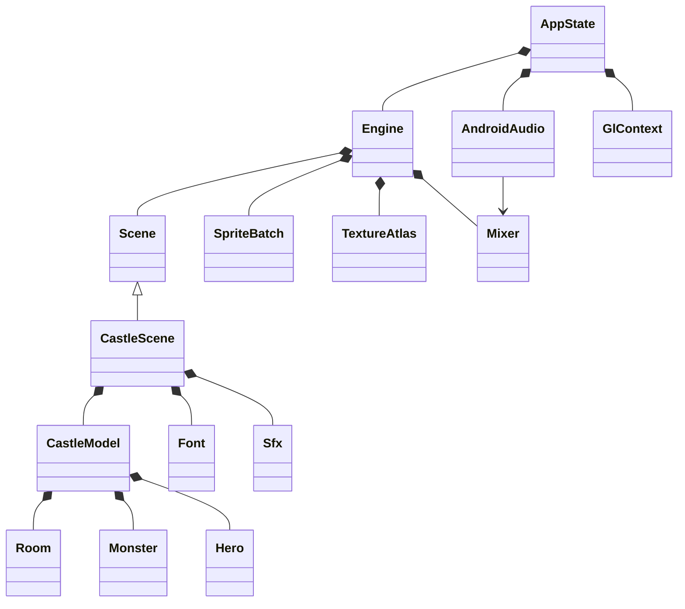

# 컴포넌트 구조와 책임

| 컴포넌트 | 소유권과 책임 | 근거 |
|---|---|---|
| AppState | 자산 로더, Engine, 햅틱, 오디오 출력, GL 컨텍스트를 소유합니다. | `platform/android/AndroidMain.cpp:28` |
| Engine | Scene, SpriteBatch, TextureAtlas, Mixer를 소유하며 외부 AssetLoader와 Haptics를 참조합니다. | `engine/Engine.h:24` |
| CastleScene | CastleModel, Font, Sfx와 버튼 입력 상태를 소유합니다. | `app/castle/CastleScene.h:12` |
| CastleModel | 방 12개, 통로 그래프·왕좌·침공 경로, 마물 최대 8개, 용사 최대 12개와 재화·날짜·도감을 관리합니다. | `app/castle/CastleModel.h:39` |
| Room / Monster / Hero | 시설과 개체의 값 데이터를 보관하는 구조체입니다. | `app/castle/CastleModel.h:32` |
| Font / TextureAtlas | ASCII와 지정된 UTF-8 글리프를 베이크하고 공용 GPU 텍스처에 패킹합니다. | `engine/graphics/Font.cpp:37` |
| Mixer / AndroidAudio | 게임 스레드의 재생 요청을 AAudio 콜백에서 혼합합니다. Sound 수명은 재생보다 길어야 합니다. | `engine/audio/Mixer.cpp:8` |

Scene 교체는 Engine이 관리하지만 현재 게임은 CastleScene 하나 안에서 준비·방어·결과 상태를 전환합니다. 모델의 전투 업데이트는 고정 크기 배열을 사용하며 그래픽이나 Android 호출을 하지 않습니다. `app/castle/CastleModel.cpp:197`

통로는 방별 비트 마스크로 양방향 연결을 표현합니다. 편집하거나 침공을 시작할 때 고정 배열 BFS로 최단 경로를 구하며, Scene과 전투는 같은 InvasionRoute를 읽습니다. Hero.position은 방 번호가 아닌 경로상의 진행 위치이고 heroRoom이 실제 방으로 변환합니다. 시설 인접 보너스는 통로 개폐와 관계없는 공간 인접 규칙입니다. 근거: `app/castle/CastleModel.cpp`의 rebuildRoute, heroRoom, adjacentFacilities와 [D-011](decisions.md).

몬스터 외형은 RGBA 이미지 시트의 3×2 칸을 Species 순서로 나누어 사용합니다. CastleScene이 시작할 때 공용 TextureAtlas에 로드하고, 지도·도감·합성·결과에서 저장한 Sprite를 공유합니다. 희미한 표시와 상하 움직임은 렌더링에만 적용되며 게임 모델의 능력치와 저장 ID를 바꾸지 않습니다. `app/castle/MonsterArt.h:7`, `app/castle/CastleScene.cpp:29`
