# 컴포넌트 구조와 책임

**수정할 클래스가 속한 패키지의 절로 이동해 책임과 상속 관계부터 확인하세요.**

| 지금 확인할 내용 | 이동할 절 |
|---|---|
| app 패키지의 클래스를 수정합니다. | [app](#app) |
| engine 패키지의 클래스를 수정합니다. | [engine](#engine) |
| platform 패키지의 클래스를 수정합니다. | [platform](#platform) |

## 전체 구조도

```mermaid
classDiagram
    class AppState {
        +AppState()
        +animating()
    }
    class DodgeGame {
        +DodgeGame()
        +onEnter()
        +update()
        +render()
        +onTouch()
        +isFinished()
    }
    class Falling {
    }
    class Kind {
    }
    class GameAssets {
        +load()
        +dinoIdle()
        +dinoRun()
        +dinoJump()
        +dinoDead()
        +groundTile()
    }
    class GameId {
    }
    class GameInfo {
    }
    class HighScores {
        +load()
        +best()
        +submit()
        +save()
    }
    class IMiniGame {
        +~IMiniGame()
        +isFinished()
        +score()
    }
    class JumpGame {
        +JumpGame()
        +onEnter()
        +update()
        +render()
        +onTouch()
        +isFinished()
    }
    class Column {
    }
    class DeathCause {
    }
    class MenuScene {
        +MenuScene()
        +onEnter()
        +update()
        +render()
        +onTouch()
        +iconFor()
    }
    class MiniGameApp {
        +onEnter()
        +update()
        +render()
        +onTouch()
        +onBack()
        +showMenu()
    }
    class ResultScene {
        +ResultScene()
        +onEnter()
        +update()
        +render()
        +onTouch()
        +onBack()
    }
    class Outcome {
    }
    class Sfx {
        +build()
    }
    class TapGame {
        +TapGame()
        +onEnter()
        +update()
        +render()
        +onTouch()
        +isFinished()
    }
    class Button {
        +Button()
        +handleTouch()
        +update()
        +draw()
        +rect()
        +setRect()
    }
    class Popups {
        +add()
        +update()
        +render()
        +clear()
    }
    class Item {
    }
    class Animation {
        +Animation()
        +fromAtlas()
        +update()
        +restart()
        +frame()
        +finished()
    }
    class AssetLoader {
        +~AssetLoader()
        +readFile()
    }
    class Color {
        +Color()
        +white()
        +black()
        +rgb8()
        +withAlpha()
    }
    class Engine {
        +Engine()
        +~Engine()
        +operator=()
        +setHaptics()
        +setDataPath()
        +initGraphics()
    }
    class Font {
        +load()
        +draw()
        +measure()
        +isLoaded()
        +glyph()
    }
    class Glyph {
    }
    class Haptics {
        +~Haptics()
        +vibrate()
        +light()
        +medium()
        +heavy()
    }
    class Strength {
    }
    class Image {
        +isValid()
        +load()
    }
    class Mixer {
        +play()
        +render()
        +setMasterGain()
    }
    class Voice {
    }
    class NullHaptics {
        +vibrate()
    }
    class Particles {
        +Particles()
        +emit()
        +update()
        +render()
        +clear()
        +count()
    }
    class Burst {
    }
    class Particle {
    }
    class Rect {
        +Rect()
        +fromCenter()
        +left()
        +right()
        +top()
        +bottom()
    }
    class Scene {
        +~Scene()
        +onEnter()
        +onExit()
        +update()
        +render()
        +onTouch()
    }
    class Shader {
        +Shader()
        +~Shader()
        +operator=()
        +build()
        +use()
        +uniform()
    }
    class Sound {
        +empty()
    }
    class Sprite {
        +isValid()
        +size()
    }
    class SpriteBatch {
        +SpriteBatch()
        +~SpriteBatch()
        +operator=()
        +init()
        +begin()
        +end()
    }
    class Vertex {
    }
    class TextAlign {
    }
    class Texture {
        +Texture()
        +~Texture()
        +operator=()
        +create()
        +upload()
        +bind()
    }
    class TextureAtlas {
        +TextureAtlas()
        +add()
        +get()
        +has()
        +texture()
    }
    class Timer {
        +Timer()
        +tick()
        +reset()
        +elapsed()
    }
    class TouchEvent {
    }
    class Phase {
    }
    class Vec2 {
        +Vec2()
        +operator+()
        +operator-()
        +operator*()
        +operator/()
        +operator+=()
    }
    class AndroidAssetLoader {
        +AndroidAssetLoader()
        +readFile()
    }
    class AndroidAudio {
        +AndroidAudio()
        +~AndroidAudio()
        +start()
        +stop()
        +onData()
        +onError()
    }
    class AndroidHaptics {
        +AndroidHaptics()
        +~AndroidHaptics()
        +vibrate()
        +resolve()
    }
    class GlContext {
        +GlContext()
        +~GlContext()
        +operator=()
        +createSurface()
        +destroySurface()
        +shutdown()
    }
    Haptics <|-- NullHaptics
    Scene <|-- IMiniGame
    IMiniGame <|-- DodgeGame
    IMiniGame <|-- JumpGame
    IMiniGame <|-- TapGame
    Scene <|-- MiniGameApp
    Scene <|-- MenuScene
    Scene <|-- ResultScene
    AssetLoader <|-- AndroidAssetLoader
    Haptics <|-- AndroidHaptics
    TouchEvent --> Phase
    TouchEvent --> Vec2
    Mixer --> Voice
    Voice --> Sound
    Sprite --> Texture
    SpriteBatch --> Shader
    SpriteBatch --> Texture
    SpriteBatch --> Sprite
    SpriteBatch --> Vertex
    TextureAtlas --> Texture
    TextureAtlas --> Sprite
    Engine --> AssetLoader
    Engine --> SpriteBatch
    Engine --> TextureAtlas
    Engine --> Scene
    Engine --> Timer
    Engine --> Mixer
    Engine --> NullHaptics
    Engine --> Haptics
    Animation --> Sprite
    Font --> Sprite
    Font --> Glyph
    Particles --> Particle
    Burst --> Color
    Burst --> Sprite
    Particle --> Vec2
    Particle --> Color
    Particle --> Sprite
    Sfx --> Sound
    GameAssets --> Texture
    GameAssets --> Sprite
    GameAssets --> Animation
    GameAssets --> Font
    GameAssets --> Sfx
    File --> Sprite
    GameInfo --> GameId
    GameInfo --> Color
    Popups --> Item
    Item --> Vec2
    Item --> Color
    DodgeGame --> GameAssets
    DodgeGame --> Engine
    DodgeGame --> Font
    DodgeGame --> Sprite
    DodgeGame --> Animation
    DodgeGame --> Particles
    DodgeGame --> Popups
    DodgeGame --> Vec2
    DodgeGame --> Falling
    Falling --> Kind
    Falling --> Sprite
    Falling --> Vec2
    JumpGame --> GameAssets
    JumpGame --> Engine
    JumpGame --> Font
    JumpGame --> Sprite
    JumpGame --> Animation
    JumpGame --> Particles
    JumpGame --> Column
    JumpGame --> Vec2
    JumpGame --> DeathCause
    TapGame --> GameAssets
    TapGame --> Engine
    TapGame --> Font
    TapGame --> Sprite
    TapGame --> Particles
    TapGame --> Popups
    TapGame --> Vec2
    HighScores --> GameId
    Button --> Rect
    Button --> Sprite
    MiniGameApp --> Engine
    MiniGameApp --> GameAssets
    MiniGameApp --> HighScores
    MiniGameApp --> Scene
    MiniGameApp --> IMiniGame
    MiniGameApp --> GameId
    MiniGameApp --> Button
    MenuScene --> GameAssets
    MenuScene --> HighScores
    MenuScene --> Engine
    MenuScene --> Sprite
    MenuScene --> Animation
    MenuScene --> Button
    ResultScene --> GameAssets
    ResultScene --> Outcome
    ResultScene --> Engine
    ResultScene --> Sprite
    ResultScene --> Rect
    ResultScene --> Button
    ResultScene --> Particles
    Outcome --> GameId
    AndroidAssetLoader --> AAssetManager
    AndroidAudio --> Mixer
    AppState --> AndroidAssetLoader
    AppState --> Engine
    AppState --> AndroidHaptics
    AppState --> AndroidAudio
    AppState --> GlContext
```

## app

| 클래스 | 선언 위치 | 상속 | 책임 (주석) |
|---|---|---|---|
| `app::Sfx` | `app/Sfx.h:12` | – | Every sound effect in the game, synthesised at startup (no audio files). |
| `app::GameAssets` | `app/GameAssets.h:19` | – | Everything the menu and the mini games share, loaded once at startup. Games take a const reference and copy the Sprites/Animations they need. |
| `app::IMiniGame` | `app/IMiniGame.h:11` | `engine::Scene` | Contract every mini game implements. The app drives it like any Scene and polls isFinished() each frame to move on to the result screen. |
| `app::GameId` | `app/GameRegistry.h:13` | – | 확인 필요 |
| `app::GameInfo` | `app/GameRegistry.h:19` | – | 확인 필요 |
| `app::ui::Popups` | `app/ui/Popups.h:17` | – | Floating score texts ("+5", "CLOSE!"): pop in with overshoot, rise, fade. |
| `app::ui::Popups::Item` | `app/ui/Popups.h:46` | – | 확인 필요 |
| `app::DodgeGame` | `app/games/DodgeGame.h:20` | `app::IMiniGame` | Stones and crates rain from the sky; hold the left or right half of the screen to run. Survive for points, and earn a bonus for every near miss. |
| `app::DodgeGame::Kind` | `app/games/DodgeGame.h:33` | – | 확인 필요 |
| `app::DodgeGame::Falling` | `app/games/DodgeGame.h:35` | – | 확인 필요 |
| `app::JumpGame` | `app/games/JumpGame.h:20` | `app::IMiniGame` | Endless runner: the ground scrolls left, tap to jump over gaps and jellies. One tap in the air gives a second jump. Score is distance in metres. |
| `app::JumpGame::Column` | `app/games/JumpGame.h:34` | – | One tile-wide slice of the level, generated ahead of the player. |
| `app::JumpGame::DeathCause` | `app/games/JumpGame.h:42` | – | 확인 필요 |
| `app::TapGame` | `app/games/TapGame.h:18` | `app::IMiniGame` | Ten seconds on the clock: smash the crate as many times as you can. Every tap dents it; every tenth tap breaks it and a fresh one drops in. |
| `app::HighScores` | `app/HighScores.h:11` | – | Best score per game, persisted as a tiny text file in the app's data dir. |
| `app::ui::Button` | `app/ui/Button.h:20` | – | Sprite-skinned button (GUI pack face) with an optional centred label. Press: shrinks slightly and darkens. Release inside: springs back with overshoot and reports a tap. The hit rect is at least 48dp- |
| `app::MiniGameApp` | `app/MiniGameApp.h:20` | `engine::Scene` | Root scene: loads shared assets, then flips between menu, game and result. Scene switches requested from callbacks are applied at the start of the next update so a scene never destroys itself mid-call |
| `app::MenuScene` | `app/scenes/MenuScene.h:18` | `engine::Scene` | Title screen: one card per registered game, plus the dino idling on the ground. |
| `app::ResultScene` | `app/scenes/ResultScene.h:16` | `engine::Scene` | Shown after a mini game ends: score, best score, retry / home. |
| `app::ResultScene::Outcome` | `app/scenes/ResultScene.h:18` | – | 확인 필요 |

개발자는 패키지 `app` 의 클래스들이 각자 책임지는 역할과 서로 어떻게 연결되는지 먼저 파악해야 합니다. `app::MiniGameApp` 이 루트 장면으로 모든 공유 자원을 로드하고 메뉴, 게임, 결과 화면을 순환하며, 이를 구동하는 것은 `engine::Scene` 인터페이스를 통해 이루어집니다 `app/MiniGameApp.h:20`. 각 미니 게임은 `app::IMiniGame` 을 구현하여 프레임당 `isFinished()` 를 체크받으며 진행됩니다 `app/IMiniGame.h:11`.

`app::Sfx` 는 게임 시작 시 합성된 모든 사운드 효과를 책임지며, 이는 `build()` 메서드를 통해 초기화됩니다 `app/Sfx.cpp:9`. 반면 `app::GameAssets` 는 메뉴와 미니 게임이 공유하는 스프라이트 및 애니메이션을 한 번에 로드하며, 게임들은 필요할 때 상수 참조를 받아 복사합니다 `app/GameAssets.h:19`.

미니 게임의 구체적인 로직은 `app::DodgeGame`, `app::JumpGame`, `app::TapGame` 이 각각 구현하고 있습니다. 이들은 모두 `app::IMiniGame` 을 상속받아 공통된 인터페이스를 따르며, `MiniGameApp`에서 `update()`와 `render()` 호출을 전달받습니다 `app/games/DodgeGame.h:20`.

사용자 입력은 각 장면의 `onTouch`에서 처리하며 `app::ui::Button::handleTouch`는 버튼 입력을 판정합니다. `app::ui::Popups`는 점수 텍스트를 갱신하고 그리는 표시 요소이며 입력 처리기는 아닙니다 (`app/ui/Button.h:20`, `app/ui/Popups.h:17`).

데이터 영속성은 `app::HighScores` 가 담당하며, 이는 텍스트 파일로 점수를 저장하고 새로운 기록일 때 즉시 업데이트합니다. 이 정보는 각 미니 게임이 종료될 때 제출되며, 결과 장면에서 최고 점수로 표시됩니다 `app/HighScores.cpp:28`.

현재 문서에는 `app::GameId`, `app::GameInfo`, `app::ui::Popups::Item` 등의 클래스에 대한 구체적인 책임이나 메서드 동작에 대한 사실 정보가 부족합니다. 이러한 미확인 사항들은 실제 소스 코드 검토를 통해 확인해야 합니다.

??? note "근거와 검토 정보: app"
    - 근거 파일: `app/GameAssets.cpp`, `app/GameAssets.h`, `app/GameRegistry.h`, `app/HighScores.cpp`, `app/HighScores.h`, `app/IMiniGame.h`, `app/MiniGameApp.cpp`, `app/MiniGameApp.h`, `app/Sfx.cpp`, `app/Sfx.h`, `app/games/DodgeGame.cpp`, `app/games/DodgeGame.h`, `app/games/JumpGame.cpp`, `app/games/JumpGame.h`, `app/games/TapGame.cpp`, `app/games/TapGame.h`, `app/scenes/MenuScene.cpp`, `app/scenes/MenuScene.h`, `app/scenes/ResultScene.cpp`, `app/scenes/ResultScene.h`, `app/ui/Button.h`, `app/ui/Popups.h`
    - 근거 수준: 코드 확인 (정적 분석, simple_compdb 구성, commit `b4e0160483`)
    - 인용 검증: 통과
    - 검토: 2026-09-17 · ollama/qwen3.5:4b · 사람 검토 전

## engine

| 클래스 | 선언 위치 | 상속 | 책임 (주석) |
|---|---|---|---|
| `engine::Vec2` | `engine/math/Vec2.h:7` | – | 확인 필요 |
| `engine::TouchEvent` | `engine/input/TouchEvent.h:10` | – | Platform-neutral touch event in world coordinates. |
| `engine::TouchEvent::Phase` | `engine/input/TouchEvent.h:11` | – | 확인 필요 |
| `engine::Scene` | `engine/Scene.h:12` | – | One screen of the app (menu, a mini game, result). The engine drives exactly one scene at a time. |
| `engine::Sound` | `engine/audio/Sound.h:8` | – | Mono PCM clip at Mixer::kSampleRate. |
| `engine::Mixer` | `engine/audio/Mixer.h:14` | – | Polyphonic sample mixer. play() is called from the game thread, render() from the audio callback; voices are claimed with atomics so neither side blocks. Sounds must outlive any voice playing them. |
| `engine::Mixer::Voice` | `engine/audio/Mixer.h:27` | – | 확인 필요 |
| `engine::Timer` | `engine/core/Timer.h:9` | – | Frame timer. tick() returns the seconds elapsed since the previous tick, clamped so a long pause (app switch, debugger) does not explode physics. |
| `engine::Shader` | `engine/graphics/Shader.h:10` | – | Compiled + linked GLSL ES program. |
| `engine::Sprite` | `engine/graphics/Sprite.h:11` | – | A rectangular region of a texture, in normalized UV coordinates, plus the region's size in pixels so callers can draw it at native scale. |
| `engine::Texture` | `engine/graphics/Texture.h:12` | – | GPU texture (RGBA8). Owns the GL object. |
| `engine::Color` | `engine/math/Color.h:5` | – | 확인 필요 |
| `engine::Rect` | `engine/math/Rect.h:9` | – | Axis-aligned rectangle. Origin is the top-left corner; y grows downward, matching screen coordinates. |
| `engine::SpriteBatch` | `engine/graphics/SpriteBatch.h:21` | – | Accumulates textured quads and submits them in as few draw calls as possible. A flush happens when the bound texture changes or the buffer fills up. |
| `engine::SpriteBatch::Vertex` | `engine/graphics/SpriteBatch.h:55` | – | 확인 필요 |
| `engine::TextureAtlas` | `engine/graphics/TextureAtlas.h:18` | – | Packs many small images into one GPU texture at load time so the sprite batch can draw everything with a single texture bind. Uses shelf packing: images fill a row left to right; when a row is full, a |
| `engine::Haptics` | `engine/platform/Haptics.h:7` | – | Vibration feedback. The Android implementation goes through JNI; the default no-op keeps games free of null checks. |
| `engine::Haptics::Strength` | `engine/platform/Haptics.h:9` | – | 확인 필요 |
| `engine::NullHaptics` | `engine/platform/Haptics.h:19` | `engine::Haptics` | 확인 필요 |
| `engine::Engine` | `engine/Engine.h:24` | – | Platform-independent core: owns the renderer, the sprite atlas, the audio mixer and the active scene, and maps screen pixels to a fixed-width world. |
| `engine::AssetLoader` | `engine/asset/AssetLoader.h:11` | – | Platform-neutral file access. The Android implementation reads from the APK's AAssetManager; a desktop build could read from disk. |
| `engine::Image` | `engine/asset/Image.h:11` | – | Decoded RGBA8 pixels in CPU memory. |
| `engine::Animation` | `engine/graphics/Animation.h:13` | – | A sequence of atlas sprites played at a fixed frame rate. |
| `engine::TextAlign` | `engine/graphics/Font.h:17` | – | 확인 필요 |
| `engine::Font` | `engine/graphics/Font.h:22` | – | Bitmap font baked from a TTF with stb_truetype into the shared atlas. Glyphs are baked once at kBakePixelHeight and scaled when drawn, which is fine for the sizes a phone HUD uses. |
| `engine::Font::Glyph` | `engine/graphics/Font.h:40` | – | 확인 필요 |
| `engine::Particles` | `engine/graphics/Particles.h:16` | – | Lightweight CPU particle pool: bursts of squares (or a sprite) with gravity, drag, spin and fade. Enough for dust, confetti and hit sparks. |
| `engine::Particles::Burst` | `engine/graphics/Particles.h:18` | – | 확인 필요 |
| `engine::Particles::Particle` | `engine/graphics/Particles.h:44` | – | 확인 필요 |

`engine::Engine` 이 애플리케이션의 핵심으로 렌더러, 스프라이트 아틀라스, 오디오 믹서 및 활성 장면을 소유하며 화면 픽셀을 고정 폭 세계로 매핑합니다 `engine/Engine.h:24`. 각 하위 컴포넌트는 특정 자원을 생성하고 해제하는 책임을 가지며, `engine::Engine` 이 전체 리소스 관리의 중심 역할을 수행합니다.

`engine::Scene` 은 앱의 한 화면을 담당하며 엔진이 한 번에 하나의 루트 장면을 구동합니다 `engine/Scene.h:12`. `onEnter`, `update`, `render` 메서드를 통해 프레임 루프에 참여하고, `onBack` 을 통해 시스템 백 버튼을 처리합니다 `engine/Scene.h:16~23`.

`engine::SpriteBatch` 는 텍스처화된 쿼드를 누적하여 최소한의 드로우 호출로 제출하며, 바인딩된 텍스처 변경 시 플러시를 수행합니다 `engine/graphics/SpriteBatch.h:21`. 내부적으로 `Vertex` 구조체를 사용하여 정렬된 데이터를 관리합니다 `engine/graphics/SpriteBatch.h:55`.

`engine::TextureAtlas` 는 여러 작은 이미지를 로드 시간 동안 하나의 GPU 텍스처에 패킹하며, shelf packing 방식을 사용합니다 `engine/graphics/TextureAtlas.h:18`. `add` 메서드는 파일이 누락되거나 아틀라스가 가득 차면 false 를 반환합니다 `engine/graphics/TextureAtlas.cpp:22`.

`engine::Font` 는 TTF 파일을 `stb_truetype` 로 변환하여 공유 아틀라스에 한 번만 베이킹하며, 드로잉 시 스케일링을 수행합니다 `engine/graphics/Font.h:22`. `load` 메서드는 ASCII 32..126 글자를 패킹합니다 `engine/graphics/Font.cpp:23`.

`engine::Particles` 은 가벼운 CPU 파티클 풀을 제공하며, 중력, 드래그, 회전 및 페이드 효과를 적용합니다 `engine/graphics/Particles.h:16`. `emit` 메서드는 파티클 버스트를 생성하고, `update` 는 물리 시뮬레이션을 수행합니다 `engine/graphics/Particles.cpp:11~41`.

`engine::Animation` 은 아틀라스 스프라이트의 고정 프레임 레이트 시퀀스를 재생하며, `<prefix>_01` 형식의 파일 이름을 사용하여 프레임을 수집합니다 `engine/graphics/Animation.h:13`. `fromAtlas` 메서드는 누락된 파일이 나올 때까지 프레임을 모읍니다 `engine/graphics/Animation.cpp:10`.

`engine::Sound` 과 `engine::Mixer` 는 Mono PCM 클립과 다중 채널 믹서를 관리하며, `play` 를 게임 스레드에서 호출하고 `render` 를 오디오 콜백에서 실행합니다 `engine/audio/Mixer.h:14`. `Mixer::Voice` 는 원자 (atomics) 로 목소리를 확보하여 블로킹을 방지합니다 `engine/audio/Mixer.h:27`.

`engine::AssetLoader` 는 플랫폼 중립적인 파일 접근을 제공하며, Android 구현은 APK 의 AAssetManager 를 사용합니다 `engine/asset/AssetLoader.h:11`. `readFile` 은 전체 파일을 반환하거나 존재하지 않으면 빈 벡터를 반환합니다 `engine/asset/AssetLoader.h:16`.

`engine::Haptics` 는 진동 피드백을 제공하며, Android 구현은 JNI 를 통해 작동하고 기본값은 no-op 입니다 `engine/platform/Haptics.h:7`. `NullHaptics` 는 `engine::Haptics` 를 상속받아 null 체크를 방지합니다 `engine/platform/Haptics.h:19`.

`engine::Texture` 는 GPU 텍스처 (RGBA8) 를 소유하며 GL 객체를 관리합니다 `engine/graphics/Texture.h:12`. `create` 메서드는 빈 텍스처를 할당하고, `upload` 는 RGBA8 픽셀을 복사합니다 `engine/graphics/Texture.cpp:28~51`.

`engine::Shader` 는 컴파일 및 링크된 GLSL ES 프로그램을 소유하며, `build` 와 `use` 를 통해 리소스를 준비하고 활성화합니다 `engine/graphics/Shader.h:10`. `compile` 메서드는 소스 코드를 컴파일합니다 `engine/graphics/Shader.cpp:16`.

`engine::SpriteBatch` 는 버퍼를 채우거나 바인딩된 텍스처가 변경될 때 플러시를 수행하며, `flush` 를 통해 드로우 호출을 제출합니다 `engine/graphics/SpriteBatch.h:21`.

`engine::Engine` 은 렌더러, 스프라이트 아틀라스, 오디오 믹서 및 활성 장면을 소유하며, `initGraphics` 는 현재 GL 컨텍스트가 있는 상태에서 호출되어야 합니다 `engine/Engine.cpp:21`. `setScene` 을 통해 활성 장면을 설정하고, `frame` 은 한 번의 업데이트 및 렌더링 패스를 수행합니다 `engine/Engine.h:41~77`.

`engine::Vec2`, `engine::Color`, `engine::SpriteBatch::Vertex`, `engine::Haptics::Strength`, `engine::Font::Glyph`, `engine::Particles::Burst`, `engine::Particles::Particle` 의 구체적인 책임은 사실에 명시되지 않았습니다. 각 클래스의 내부 동작과 설계 의도를 확인해야 합니다.

`engine::Mixer::Voice` 의 정확한 소유권 및 생명주기는 사실에서 명확하지 않습니다. 원자 (atomics) 를 통한 확보 메커니즘이 어떻게 작동하는지 확인해야 합니다.

`engine::Sound` 의 `empty()` 메서드와 `engine::Color`, `engine::TextAlign` 의 역할은 사실에 대한 설명이 부족합니다. 해당 클래스의 실제 동작을 확인해야 합니다.

`engine::Timer` 의 `tick()` 값이 클램핑되는 구체적인 알고리즘과 `elapsed()` 의 정확한 계산 방식은 설계 문서에서 명시되지 않았습니다. 타이밍 정확도와 장기 정지 시 동작을 확인해야 합니다.

`engine::SpriteBatch::drawCalls()` 는 현재 드로우 호출 수를 반환하는 것으로 보이나, 실제 플러시 로직과의 관계는 확인이 필요합니다.

`engine::Font::glyph()` 메서드는 `Glyph` 객체를 반환하는지, 아니면 직접적인 데이터를 제공하는지 확인해야 합니다.

`engine::Particles::Particle` 의 상태 관리와 `update` 로직의 세부 사항은 사실에 명시되지 않았습니다. 파티클 시스템의 안정성을 위해 확인이 필요합니다.

??? note "근거와 검토 정보: engine"
    - 근거 파일: `engine/Engine.cpp`, `engine/Engine.h`, `engine/Scene.h`, `engine/asset/AssetLoader.h`, `engine/asset/Image.cpp`, `engine/asset/Image.h`, `engine/audio/Mixer.cpp`, `engine/audio/Mixer.h`, `engine/audio/Sound.h`, `engine/core/Timer.h`, `engine/graphics/Animation.cpp`, `engine/graphics/Animation.h`, `engine/graphics/Font.cpp`, `engine/graphics/Font.h`, `engine/graphics/Particles.cpp`, `engine/graphics/Particles.h`, `engine/graphics/Shader.cpp`, `engine/graphics/Shader.h`, `engine/graphics/Sprite.h`, `engine/graphics/SpriteBatch.cpp`, `engine/graphics/SpriteBatch.h`, `engine/graphics/Texture.cpp`, `engine/graphics/Texture.h`, `engine/graphics/TextureAtlas.cpp`, `engine/graphics/TextureAtlas.h`, `engine/input/TouchEvent.h`, `engine/math/Color.h`, `engine/math/Rect.h`, `engine/math/Vec2.h`, `engine/platform/Haptics.h`
    - 근거 수준: 코드 확인 (정적 분석, simple_compdb 구성, commit `b4e0160483`)
    - 인용 검증: 통과
    - 검토: 2026-09-17 · ollama/qwen3.5:4b · 사람 검토 전

## platform

| 클래스 | 선언 위치 | 상속 | 책임 (주석) |
|---|---|---|---|
| `platform::android::AndroidAssetLoader` | `platform/android/AndroidAssetLoader.h:10` | `engine::AssetLoader` | Reads files packed into the APK's assets/ directory. |
| `platform::android::AndroidAudio` | `platform/android/AndroidAudio.h:12` | – | Low-latency output stream that pulls samples from the engine Mixer. |
| `platform::android::AndroidHaptics` | `platform/android/AndroidHaptics.h:13` | `engine::Haptics` | Drives android.os.Vibrator through JNI. There is no NDK vibration API, so this is the one place the project touches Java at runtime. |
| `platform::android::GlContext` | `platform/android/GlContext.h:12` | – | Owns the EGL display and context for the app's lifetime, and a window surface that comes and goes with the Activity's window. Keeping the context across surface loss means GL textures and buffers surv |
| `AppState` | `platform/android/AndroidMain.cpp:28` | – | 확인 필요 |

`platform::android::AndroidAssetLoader` 는 APK 의 assets 디렉토리에 포함된 파일을 읽는 책임을 지며, 이는 `engine::AssetLoader` 를 상속받습니다 `platform/android/AndroidAssetLoader.h:10`. 이 클래스는 `AndroidAssetLoader()` 생성자에서 초기화되며 `readFile()` 메서드를 통해 실제 파일 데이터를 반환합니다 `platform/android/AndroidAssetLoader.cpp:10`.

`platform::android::AndroidAudio` 는 엔진 믹서(Mixer) 에서 샘플을 추출하여 저지연 출력 스트림을 제공하는 역할을 합니다 `platform/android/AndroidAudio.h:12`. 이 클래스는 `start()` 를 호출하면 오디오 데이터를 처리하고, `onData()` 콜백을 통해 샘플을 받으며, `stop()` 을 호출하면 스트림을 종료합니다 `platform/android/AndroidAudio.cpp:15`.

`platform::android::AndroidHaptics` 는 JNI 를 통해 `android.os.Vibrator` 를 구동하며, NDK 진동 API 가 없기 때문에 이 클래스가 런타임에서 자바를 만나는 유일한 장소입니다 `platform/android/AndroidHaptics.h:13`. `vibrate()` 메서드가 호출되면 진동기가 작동하고, `resolve()` 는 관련 설정을 해결합니다 `platform/android/AndroidHaptics.cpp:102`.

`platform::android::GlContext` 는 앱의 수명 동안 EGL 디스플레이와 컨텍스트를 소유하며, Activity 의 윈도우가 사라지고 다시 나타날 때 함께 생성되고 소멸되는 윈도우 서페이스를 관리합니다 `platform/android/GlContext.h:12`. 컨텍스트를 서페이스 손실 후에도 유지함으로써 GL 텍스처와 버퍼가 생존하게 하며, `createSurface()` 를 호출하면 디스플레이와 컨텍스트를 처음 생성한 뒤 서페이스를 만듭니다 `platform/android/GlContext.cpp:50`.

`AppState` 클래스의 책임은 현재 문서에 명시된 사실로 확인되지 않았습니다. `animating()` 메서드가 존재하지만 이 클래스가 구체적으로 무엇을 담당하는지, 그리고 어떤 리소스를 소유하거나 해제하는지는 추가 조사가 필요합니다 `platform/android/AndroidMain.cpp:42`.

??? note "근거와 검토 정보: platform"
    - 근거 파일: `platform/android/AndroidAssetLoader.cpp`, `platform/android/AndroidAssetLoader.h`, `platform/android/AndroidAudio.cpp`, `platform/android/AndroidAudio.h`, `platform/android/AndroidHaptics.cpp`, `platform/android/AndroidHaptics.h`, `platform/android/AndroidMain.cpp`, `platform/android/GlContext.cpp`, `platform/android/GlContext.h`
    - 근거 수준: 코드 확인 (정적 분석, simple_compdb 구성, commit `b4e0160483`)
    - 인용 검증: 통과
    - 검토: 2026-09-17 · ollama/qwen3.5:4b · 사람 검토 전

??? note "근거와 검토 정보"
    - 근거 파일: `app/GameAssets.cpp`, `app/GameAssets.h`, `app/GameRegistry.h`, `app/HighScores.cpp`, `app/HighScores.h`, `app/IMiniGame.h`, `app/MiniGameApp.cpp`, `app/MiniGameApp.h`, `app/Sfx.cpp`, `app/Sfx.h`, `app/games/DodgeGame.cpp`, `app/games/DodgeGame.h`, `app/games/JumpGame.cpp`, `app/games/JumpGame.h`, `app/games/TapGame.cpp`, `app/games/TapGame.h`, `app/scenes/MenuScene.cpp`, `app/scenes/MenuScene.h`, `app/scenes/ResultScene.cpp`, `app/scenes/ResultScene.h`, `app/ui/Button.h`, `app/ui/Popups.h`, `engine/Engine.cpp`, `engine/Engine.h`, `engine/Scene.h`, `engine/asset/AssetLoader.h`, `engine/asset/Image.cpp`, `engine/asset/Image.h`, `engine/audio/Mixer.cpp`, `engine/audio/Mixer.h`, `engine/audio/Sound.h`, `engine/core/Timer.h`, `engine/graphics/Animation.cpp`, `engine/graphics/Animation.h`, `engine/graphics/Font.cpp`, `engine/graphics/Font.h`, `engine/graphics/Particles.cpp`, `engine/graphics/Particles.h`, `engine/graphics/Shader.cpp`, `engine/graphics/Shader.h`, `engine/graphics/Sprite.h`, `engine/graphics/SpriteBatch.cpp`, `engine/graphics/SpriteBatch.h`, `engine/graphics/Texture.cpp`, `engine/graphics/Texture.h`, `engine/graphics/TextureAtlas.cpp`, `engine/graphics/TextureAtlas.h`, `engine/input/TouchEvent.h`, `engine/math/Color.h`, `engine/math/Rect.h`, `engine/math/Vec2.h`, `engine/platform/Haptics.h`, `platform/android/AndroidAssetLoader.cpp`, `platform/android/AndroidAssetLoader.h`, `platform/android/AndroidAudio.cpp`, `platform/android/AndroidAudio.h`, `platform/android/AndroidHaptics.cpp`, `platform/android/AndroidHaptics.h`, `platform/android/AndroidMain.cpp`, `platform/android/GlContext.cpp`, `platform/android/GlContext.h`
    - 근거 수준: 코드 확인 (정적 분석, simple_compdb 구성, commit `b4e0160483`)
    - 인용 검증: 통과
    - 검토: 2026-09-17 · ollama/qwen3.5:4b · 사람 검토 전

다음 단계: [핵심 시나리오 시퀀스](scenarios/index.md)
