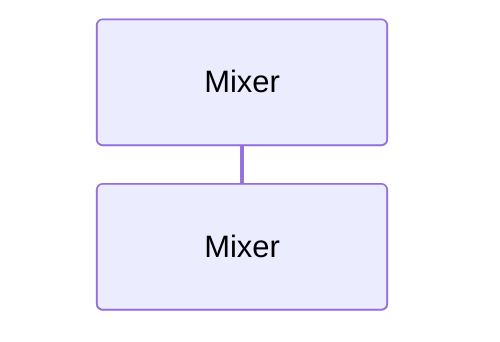

# 오디오 콜백 믹싱 (Mixer::render)

**`engine::Mixer::render(float *, int)` 에서 시작하는 호출 순서를 아래 번호대로 따라가세요.**

## 호출 순서

호출 순서를 얻지 못했습니다. 확인 필요: 진입 함수 시그니처가 clang-uml 설정과 맞는지 확인하세요.

## 이 흐름에서 확인할 것

엔진 내부에서 오디오 믹싱이 시작되는 진입점은 `engine::Mixer::render(float *, int)` 함수입니다. 이 함수는 현재 시나리오에 따라 다른 컴포넌트를 거쳐 호출 순서를 결정합니다. 하지만 호출 경로의 구체적인 흐름은 아직 확인되지 않았습니다. 진입 함수의 시그니처가 clang-uml 설정과 일치하는지 먼저 확인해야 합니다.

오디오 콜백이 처리되는 과정에서 `Scene` 의 가상 함수나 `GameRegistry` 를 통해 호출이 분기할 수 있습니다. 이러한 분기점에서 정적 추적이 끊기는 지점은 명확하지 않습니다. 현재 사실 목록에는 호출 순서와 분기 조건에 대한 정보가 포함되어 있지 않습니다.

??? note "근거와 검토 정보"
    - 근거 파일: (없음)
    - 근거 수준: 코드 확인 (정적 분석, simple_compdb 구성, commit `b4e0160483`)
    - 인용 검증: 실패 (인용이 하나도 없습니다.; 클래스나 함수를 언급하면서 인용이 없는 문단 2 개)
    - 검토: 2026-09-17 · ollama/qwen3.5:4b · 사람 검토 전

다음 단계: [한 프레임 (Engine::frame)](frame.md)
