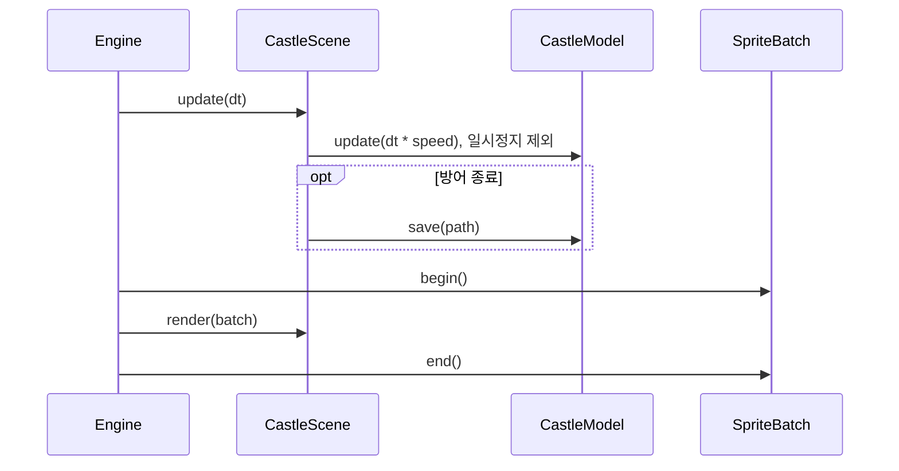

# 한 프레임과 자동 방어

Engine::frame은 그래픽 초기화 이후 타이머를 읽고 Scene::update, SpriteBatch::begin, Scene::render, SpriteBatch::end 순서로 실행합니다. `engine/Engine.cpp:77`

CastleScene은 일시정지가 아니면 속도 배율을 곱한 dt를 모델에 전달합니다. 방어 종료 프레임에서는 보상 상태를 저장하고 효과음·햅틱을 실행합니다. `app/castle/CastleScene.cpp:46`

render는 시스템 여백과 화면 높이를 반영해 지도·관리 영역을 배치하고 활성 hit 목록을 재생성합니다. 합성·결과 오버레이는 뒤 화면 입력을 차단합니다. `app/castle/CastleScene.cpp:270`, `app/castle/CastleScene.cpp:227`

