# 공유 에셋 로딩 (GameAssets::load)

**`app::GameAssets::load(engine::Engine &)` 에서 시작하는 호출 순서를 아래 번호대로 따라가세요.**

```mermaid
sequenceDiagram
    participant GameAssets
    participant Engine
    participant TextureAtlas
    participant Image
    participant AndroidAssetLoader
    participant Texture
    participant Sprite
    participant Animation
    participant Font
    participant Glyph
    participant Sfx
    participant Sound
    participant Synth
    GameAssets->>Engine: atlas()
    GameAssets->>Engine: assets()
    GameAssets->>TextureAtlas: add()
    TextureAtlas->>Image: load()
    Image->>Image: Image()
    Image-->>AndroidAssetLoader: readFile() [virtual, 현재 구현 하나]
    Image->>Image: Image()
    Image->>Image: Image()
    Image->>Image: Image()
    TextureAtlas->>Image: isValid()
    TextureAtlas->>TextureAtlas: add()
    TextureAtlas->>Texture: upload()
    TextureAtlas->>Sprite: Sprite()
    TextureAtlas->>Sprite: operator=()
    GameAssets->>Animation: operator=()
    GameAssets->>Animation: fromAtlas()
    Animation->>Animation: Animation()
    Animation->>TextureAtlas: has()
    Animation->>TextureAtlas: get()
    TextureAtlas->>Sprite: Sprite()
    Animation->>Animation: Animation()
    GameAssets->>Animation: operator=()
    GameAssets->>Animation: fromAtlas()
    Animation->>Animation: Animation()
    Animation->>TextureAtlas: has()
    Animation->>TextureAtlas: get()
    TextureAtlas->>Sprite: Sprite()
    Animation->>Animation: Animation()
    GameAssets->>Animation: operator=()
    GameAssets->>Animation: fromAtlas()
    Animation->>Animation: Animation()
    Animation->>TextureAtlas: has()
    Animation->>TextureAtlas: get()
    TextureAtlas->>Sprite: Sprite()
    Animation->>Animation: Animation()
    GameAssets->>Animation: operator=()
    GameAssets->>Animation: fromAtlas()
    Animation->>Animation: Animation()
    Animation->>TextureAtlas: has()
    Animation->>TextureAtlas: get()
    TextureAtlas->>Sprite: Sprite()
    Animation->>Animation: Animation()
    GameAssets->>TextureAtlas: add()
    TextureAtlas->>Image: load()
    Image->>Image: Image()
    Image-->>AndroidAssetLoader: readFile() [virtual, 현재 구현 하나]
    Image->>Image: Image()
    Image->>Image: Image()
    Image->>Image: Image()
    TextureAtlas->>Image: isValid()
    TextureAtlas->>TextureAtlas: add()
    TextureAtlas->>Texture: upload()
    TextureAtlas->>Sprite: Sprite()
    TextureAtlas->>Sprite: operator=()
    GameAssets->>Sprite: operator=()
    GameAssets->>TextureAtlas: get()
    TextureAtlas->>Sprite: Sprite()
    GameAssets->>Texture: create()
    Texture->>Image: isValid()
    Texture->>Texture: create()
    Texture->>Texture: release()
    Texture->>Texture: upload()
    GameAssets->>Image: load()
    Image->>Image: Image()
    Image-->>AndroidAssetLoader: readFile() [virtual, 현재 구현 하나]
    Image->>Image: Image()
    Image->>Image: Image()
    Image->>Image: Image()
    GameAssets->>Texture: width()
    GameAssets->>Texture: height()
    GameAssets->>Font: load()
    Font-->>AndroidAssetLoader: readFile() [virtual, 현재 구현 하나]
    Font->>Image: Image()
    Font->>TextureAtlas: add()
    TextureAtlas->>Texture: upload()
    TextureAtlas->>Sprite: Sprite()
    TextureAtlas->>Sprite: operator=()
    Font->>Sprite: operator=()
    Font->>TextureAtlas: get()
    TextureAtlas->>Sprite: Sprite()
    Font->>Glyph: operator=()
    GameAssets->>Sfx: build()
    Sfx->>Sound: operator=()
    Sfx->>Synth: tone()
    Synth->>Sound: Sound()
    Synth->>Synth: declick()
    Synth->>Sound: Sound()
    Sfx->>Sound: operator=()
    Sfx->>Synth: mix()
    Synth->>Sound: Sound()
    Synth->>Sound: Sound()
    Sfx->>Synth: tone()
    Synth->>Sound: Sound()
    Synth->>Synth: declick()
    Synth->>Sound: Sound()
    Sfx->>Synth: noise()
    Synth->>Sound: Sound()
    Synth-->>Synth: dist() [콜백 객체, 정적 추적 불가]
    Synth->>Synth: declick()
    Synth->>Sound: Sound()
    Sfx->>Sound: operator=()
    Sfx->>Synth: tone()
    Synth->>Sound: Sound()
    Synth->>Synth: declick()
    Synth->>Sound: Sound()
    Sfx->>Sound: operator=()
    Sfx->>Synth: tone()
    Synth->>Sound: Sound()
    Synth->>Synth: declick()
    Synth->>Sound: Sound()
    Sfx->>Sound: operator=()
    Sfx->>Synth: mix()
    Synth->>Sound: Sound()
    Synth->>Sound: Sound()
    Sfx->>Synth: noise()
    Synth->>Sound: Sound()
    Synth-->>Synth: dist() [콜백 객체, 정적 추적 불가]
    Synth->>Synth: declick()
    Synth->>Sound: Sound()
    Sfx->>Synth: tone()
    Sfx->>Sound: operator=()
    Sfx->>Synth: mix()
    Sfx->>Synth: noise()
    Sfx->>Synth: tone()
    Sfx->>Sound: operator=()
    Sfx->>Synth: mix()
    Sfx->>Synth: noise()
    Sfx->>Synth: tone()
    Sfx->>Sound: operator=()
    Sfx->>Synth: tone()
    Sfx->>Sound: operator=()
    Sfx->>Synth: mix()
    Sfx->>Synth: noise()
    Sfx->>Synth: tone()
    Sfx->>Sound: operator=()
    Sfx->>Synth: mix()
    Sfx->>Synth: noise()
    Sfx->>Synth: tone()
    Sfx->>Sound: operator=()
    Sfx->>Synth: tone()
    Sfx->>Sound: operator=()
    Sfx->>Synth: arpeggio()
    Sfx->>Sound: operator=()
    Sfx->>Synth: arpeggio()
    GameAssets->>Animation: frameCount()
    GameAssets->>Animation: frameCount()
    GameAssets->>Animation: frameCount()
    GameAssets->>Animation: frameCount()
    GameAssets->>Animation: empty()
    GameAssets->>Sprite: isValid()
    GameAssets->>Sprite: isValid()
```

## 호출 순서

1. `GameAssets` 가 `Engine::atlas()` 를 호출합니다. `app/GameAssets.cpp:14`
2. `GameAssets` 가 `Engine::assets()` 를 호출합니다. `app/GameAssets.cpp:15`
3. `GameAssets` 가 `TextureAtlas::add()` 를 호출합니다. `app/GameAssets.cpp:29`
4. `TextureAtlas` 가 `Image::load()` 를 호출합니다. `engine/graphics/TextureAtlas.cpp:23`
5. `Image` 가 `Image::Image()` 를 호출합니다. `engine/asset/Image.cpp:15`
6. `Image` 가 `AndroidAssetLoader::readFile()` 를 호출합니다. (virtual, 현재 구현 하나) `engine/asset/Image.cpp:17`
7. `Image` 가 `Image::Image()` 를 호출합니다. `engine/asset/Image.cpp:20`
8. `TextureAtlas` 가 `Image::isValid()` 를 호출합니다. `engine/graphics/TextureAtlas.cpp:24`
9. `TextureAtlas` 가 `TextureAtlas::add()` 를 호출합니다. `engine/graphics/TextureAtlas.cpp:24`
10. `TextureAtlas` 가 `Texture::upload()` 를 호출합니다. `engine/graphics/TextureAtlas.cpp:47`
11. `TextureAtlas` 가 `Sprite::Sprite()` 를 호출합니다. `engine/graphics/TextureAtlas.cpp:52`
12. `TextureAtlas` 가 `Sprite::operator=()` 를 호출합니다. `engine/graphics/TextureAtlas.cpp:60`
13. `GameAssets` 가 `Animation::operator=()` 를 호출합니다. `app/GameAssets.cpp:32`
14. `GameAssets` 가 `Animation::fromAtlas()` 를 호출합니다. `app/GameAssets.cpp:32`
15. `Animation` 가 `Animation::Animation()` 를 호출합니다. `engine/graphics/Animation.cpp:12`
16. `Animation` 가 `TextureAtlas::has()` 를 호출합니다. `engine/graphics/Animation.cpp:19`
17. `Animation` 가 `TextureAtlas::get()` 를 호출합니다. `engine/graphics/Animation.cpp:22`
18. `TextureAtlas` 가 `Sprite::Sprite()` 를 호출합니다. `engine/graphics/TextureAtlas.cpp:75`
19. `Animation` 가 `Animation::Animation()` 를 호출합니다. `engine/graphics/Animation.cpp:24`
20. `GameAssets` 가 `Animation::operator=()` 를 호출합니다. `app/GameAssets.cpp:33`
21. `GameAssets` 가 `Animation::fromAtlas()` 를 호출합니다. `app/GameAssets.cpp:33`
22. `Animation` 가 `Animation::Animation()` 를 호출합니다. `engine/graphics/Animation.cpp:12`
23. `Animation` 가 `TextureAtlas::has()` 를 호출합니다. `engine/graphics/Animation.cpp:19`
24. `Animation` 가 `TextureAtlas::get()` 를 호출합니다. `engine/graphics/Animation.cpp:22`
25. `TextureAtlas` 가 `Sprite::Sprite()` 를 호출합니다. `engine/graphics/TextureAtlas.cpp:75`
26. `Animation` 가 `Animation::Animation()` 를 호출합니다. `engine/graphics/Animation.cpp:24`
27. `GameAssets` 가 `Animation::operator=()` 를 호출합니다. `app/GameAssets.cpp:34`
28. `GameAssets` 가 `Animation::fromAtlas()` 를 호출합니다. `app/GameAssets.cpp:34`
29. `Animation` 가 `Animation::Animation()` 를 호출합니다. `engine/graphics/Animation.cpp:12`
30. `Animation` 가 `TextureAtlas::has()` 를 호출합니다. `engine/graphics/Animation.cpp:19`

(이후 단계는 생략했습니다. 전체 흐름은 위 다이어그램을 보세요.)

## 이 흐름에서 확인할 것

공유 에셋 로딩은 `GameAssets::load` 함수가 호출된 뒤부터 시작합니다. 진입점은 `app::GameAssets::load(engine::Engine &)` 입니다 `app/GameAssets.cpp:14`. 이 함수는 먼저 `Engine::atlas()` 를 호출하여 텍스처 아틀라스를 생성합니다 `app/GameAssets.cpp:15`. 이어지는 과정은 `TextureAtlas::add()` 를 통해 이미지 로딩으로 이어집니다 `app/GameAssets.cpp:29`.

텍스처 아틀라스 내부에서는 `Image::load()` 가 실행되어 실제 파일 데이터를 읽습니다 `engine/graphics/TextureAtlas.cpp:23`. 이 단계에서 `AndroidAssetLoader::readFile()` 가상 함수가 호출되며 현재는 단일 구현이 사용되고 있습니다 `engine/asset/Image.cpp:17`. 로딩된 데이터는 `Image::Image()` 생성자로 전달되어 메모리에 복사됩니다 `engine/asset/Image.cpp:15`.

로딩 완료 후 유효성 검사가 수행됩니다. `TextureAtlas` 는 `Image::isValid()` 를 호출하여 이미지 상태를 확인합니다 `engine/graphics/TextureAtlas.cpp:24`. 검사를 통과하면 `Texture::upload()` 가 실행되어 GPU 메모리로 전송됩니다 `engine/graphics/TextureAtlas.cpp:47`. 이 과정에서 `Sprite::Sprite()` 생성자가 호출되어 텍스처를 스프라이트 객체로 변환합니다 `engine/graphics/TextureAtlas.cpp:52`.

텍스처 아틀라스는 다시 `Sprite::operator=()` 를 호출하여 스프라이트에 추가된 정보를 업데이트합니다 `engine/graphics/TextureAtlas.cpp:60`. 이후 `GameAssets` 는 애니메이션 생성을 위해 `Animation::fromAtlas()` 를 호출합니다 `app/GameAssets.cpp:32`. 이 함수 내부에서는 `TextureAtlas::has()` 와 `TextureAtlas::get()` 가 순차적으로 호출되어 아틀라스 내 스프라이트를 찾습니다 `engine/graphics/Animation.cpp:19` 및 `engine/graphics/Animation.cpp:22`.

애니메이션 생성자는 `Sprite::Sprite()` 를 다시 호출하여 각 프레임의 텍스처를 초기화합니다 `engine/graphics/TextureAtlas.cpp:75`. 이 과정은 애니메이션 객체의 여러 번의 생성자 호출과 함께 반복되며, 최종적으로 `GameAssets` 가 `Animation::operator=()` 를 통해 애니메이션을 완성합니다 `app/GameAssets.cpp:33`.

확인 필요: 가상 함수나 함수 포인터 때문에 정적으로 끊긴 호출이 2 개 있습니다. 끊긴 지점 이후는 코드를 직접 따라가야 합니다.

??? note "근거와 검토 정보"
    - 근거 파일: `app/GameAssets.cpp`, `engine/asset/Image.cpp`, `engine/graphics/Animation.cpp`, `engine/graphics/TextureAtlas.cpp`
    - 근거 수준: 코드 확인 (정적 분석, simple_compdb 구성, commit `aeac213063`)
    - 인용 검증: 통과
    - 검토: 2026-09-17 · ollama/qwen3.5:4b · 사람 검토 전

다음 단계: [게임 종료와 결과 화면 (MiniGameApp::showResult)](show_result.md)
