```mermaid
sequenceDiagram
    participant GameAssets
    participant Engine
    participant TextureAtlas
    participant Image
    participant AndroidAssetLoader
    participant Texture
    participant Sprite
    participant Animation
    participant Font
    participant Glyph
    participant Sfx
    participant Sound
    participant Synth
    GameAssets->>Engine: atlas()
    GameAssets->>Engine: assets()
    GameAssets->>TextureAtlas: add()
    TextureAtlas->>Image: load()
    Image->>Image: Image()
    Image-->>AndroidAssetLoader: readFile() [virtual, 현재 구현 하나]
    Image->>Image: Image()
    Image->>Image: Image()
    Image->>Image: Image()
    TextureAtlas->>Image: isValid()
    TextureAtlas->>TextureAtlas: add()
    TextureAtlas->>Texture: upload()
    TextureAtlas->>Sprite: Sprite()
    TextureAtlas->>Sprite: operator=()
    GameAssets->>Animation: operator=()
    GameAssets->>Animation: fromAtlas()
    Animation->>Animation: Animation()
    Animation->>TextureAtlas: has()
    Animation->>TextureAtlas: get()
    TextureAtlas->>Sprite: Sprite()
    Animation->>Animation: Animation()
    GameAssets->>Animation: operator=()
    GameAssets->>Animation: fromAtlas()
    Animation->>Animation: Animation()
    Animation->>TextureAtlas: has()
    Animation->>TextureAtlas: get()
    TextureAtlas->>Sprite: Sprite()
    Animation->>Animation: Animation()
    GameAssets->>Animation: operator=()
    GameAssets->>Animation: fromAtlas()
    Animation->>Animation: Animation()
    Animation->>TextureAtlas: has()
    Animation->>TextureAtlas: get()
    TextureAtlas->>Sprite: Sprite()
    Animation->>Animation: Animation()
    GameAssets->>Animation: operator=()
    GameAssets->>Animation: fromAtlas()
    Animation->>Animation: Animation()
    Animation->>TextureAtlas: has()
    Animation->>TextureAtlas: get()
    TextureAtlas->>Sprite: Sprite()
    Animation->>Animation: Animation()
    GameAssets->>TextureAtlas: add()
    TextureAtlas->>Image: load()
    Image->>Image: Image()
    Image-->>AndroidAssetLoader: readFile() [virtual, 현재 구현 하나]
    Image->>Image: Image()
    Image->>Image: Image()
    Image->>Image: Image()
    TextureAtlas->>Image: isValid()
    TextureAtlas->>TextureAtlas: add()
    TextureAtlas->>Texture: upload()
    TextureAtlas->>Sprite: Sprite()
    TextureAtlas->>Sprite: operator=()
    GameAssets->>Sprite: operator=()
    GameAssets->>TextureAtlas: get()
    TextureAtlas->>Sprite: Sprite()
    GameAssets->>Texture: create()
    Texture->>Image: isValid()
    Texture->>Texture: create()
    Texture->>Texture: release()
    Texture->>Texture: upload()
    GameAssets->>Image: load()
    Image->>Image: Image()
    Image-->>AndroidAssetLoader: readFile() [virtual, 현재 구현 하나]
    Image->>Image: Image()
    Image->>Image: Image()
    Image->>Image: Image()
    GameAssets->>Texture: width()
    GameAssets->>Texture: height()
    GameAssets->>Font: load()
    Font-->>AndroidAssetLoader: readFile() [virtual, 현재 구현 하나]
    Font->>Image: Image()
    Font->>TextureAtlas: add()
    TextureAtlas->>Texture: upload()
    TextureAtlas->>Sprite: Sprite()
    TextureAtlas->>Sprite: operator=()
    Font->>Sprite: operator=()
    Font->>TextureAtlas: get()
    TextureAtlas->>Sprite: Sprite()
    Font->>Glyph: operator=()
    GameAssets->>Sfx: build()
    Sfx->>Sound: operator=()
    Sfx->>Synth: tone()
    Synth->>Sound: Sound()
    Synth->>Synth: declick()
    Synth->>Sound: Sound()
    Sfx->>Sound: operator=()
    Sfx->>Synth: mix()
    Synth->>Sound: Sound()
    Synth->>Sound: Sound()
    Sfx->>Synth: tone()
    Synth->>Sound: Sound()
    Synth->>Synth: declick()
    Synth->>Sound: Sound()
    Sfx->>Synth: noise()
    Synth->>Sound: Sound()
    Synth-->>Synth: dist() [콜백 객체, 정적 추적 불가]
    Synth->>Synth: declick()
    Synth->>Sound: Sound()
    Sfx->>Sound: operator=()
    Sfx->>Synth: tone()
    Synth->>Sound: Sound()
    Synth->>Synth: declick()
    Synth->>Sound: Sound()
    Sfx->>Sound: operator=()
    Sfx->>Synth: tone()
    Synth->>Sound: Sound()
    Synth->>Synth: declick()
    Synth->>Sound: Sound()
    Sfx->>Sound: operator=()
    Sfx->>Synth: mix()
    Synth->>Sound: Sound()
    Synth->>Sound: Sound()
    Sfx->>Synth: noise()
    Synth->>Sound: Sound()
    Synth-->>Synth: dist() [콜백 객체, 정적 추적 불가]
    Synth->>Synth: declick()
    Synth->>Sound: Sound()
    Sfx->>Synth: tone()
    Sfx->>Sound: operator=()
    Sfx->>Synth: mix()
    Sfx->>Synth: noise()
    Sfx->>Synth: tone()
    Sfx->>Sound: operator=()
    Sfx->>Synth: mix()
    Sfx->>Synth: noise()
    Sfx->>Synth: tone()
    Sfx->>Sound: operator=()
    Sfx->>Synth: tone()
    Sfx->>Sound: operator=()
    Sfx->>Synth: mix()
    Sfx->>Synth: noise()
    Sfx->>Synth: tone()
    Sfx->>Sound: operator=()
    Sfx->>Synth: mix()
    Sfx->>Synth: noise()
    Sfx->>Synth: tone()
    Sfx->>Sound: operator=()
    Sfx->>Synth: tone()
    Sfx->>Sound: operator=()
    Sfx->>Synth: arpeggio()
    Sfx->>Sound: operator=()
    Sfx->>Synth: arpeggio()
    GameAssets->>Animation: frameCount()
    GameAssets->>Animation: frameCount()
    GameAssets->>Animation: frameCount()
    GameAssets->>Animation: frameCount()
    GameAssets->>Animation: empty()
    GameAssets->>Sprite: isValid()
    GameAssets->>Sprite: isValid()
```

# 공유 에셋 로딩 (GameAssets::load)

**아래 코드 대조 설명을 먼저 읽으세요. 다이어그램과 번호 목록은 정적 호출 후보이며, 실행 순서·분기·콜백 시점을 정확히 재현하지 않습니다.**

## 이 흐름에서 확인할 것

`GameAssets::load`는 이미 `Engine::initGraphics`에서 만든 아틀라스의 참조를 가져옵니다. `Engine::atlas()`가 새 아틀라스를 생성하지는 않습니다 (`app/GameAssets.cpp:14`, `engine/Engine.cpp:21`). 캐릭터 프레임을 추가하고 애니메이션을 구성한 뒤 타일·오브젝트·UI 스프라이트를 로드합니다.

`Image::load`는 자산 로더로 바이트를 읽고 stb로 디코딩합니다 (`engine/asset/Image.cpp:14`). 아틀라스 추가 단계에서는 이미지 유효성과 공간을 검사한 뒤 GPU에 업로드합니다. 큰 배경은 별도 텍스처로 만들고, 폰트 로드가 실패하면 false를 반환합니다. 효과음을 합성한 뒤 주요 자산의 유효성을 최종 검사합니다. `Sprite` 값의 생성이나 복사가 그 자체로 GPU 텍스처 할당을 뜻하지 않습니다.

정적 분석 한계: 가상 호출 대상, 콜백 실행 시점, 조건 분기는 코드와 함께 확인해야 합니다. 이번 검토는 기기 실행 검증을 포함하지 않습니다.

## 정적 호출 후보 (실행 추적 아님)

1. `GameAssets` 가 `Engine::atlas()` 를 호출합니다. `app/GameAssets.cpp:14`
2. `GameAssets` 가 `Engine::assets()` 를 호출합니다. `app/GameAssets.cpp:15`
3. `GameAssets` 가 `TextureAtlas::add()` 를 호출합니다. `app/GameAssets.cpp:29`
4. `TextureAtlas` 가 `Image::load()` 를 호출합니다. `engine/graphics/TextureAtlas.cpp:23`
5. `Image` 가 `Image::Image()` 를 호출합니다. `engine/asset/Image.cpp:15`
6. `Image` 가 `AndroidAssetLoader::readFile()` 를 호출합니다. (virtual, 현재 구현 하나) `engine/asset/Image.cpp:17`
7. `Image` 가 `Image::Image()` 를 호출합니다. `engine/asset/Image.cpp:20`
8. `TextureAtlas` 가 `Image::isValid()` 를 호출합니다. `engine/graphics/TextureAtlas.cpp:24`
9. `TextureAtlas` 가 `TextureAtlas::add()` 를 호출합니다. `engine/graphics/TextureAtlas.cpp:24`
10. `TextureAtlas` 가 `Texture::upload()` 를 호출합니다. `engine/graphics/TextureAtlas.cpp:47`
11. `TextureAtlas` 가 `Sprite::Sprite()` 를 호출합니다. `engine/graphics/TextureAtlas.cpp:52`
12. `TextureAtlas` 가 `Sprite::operator=()` 를 호출합니다. `engine/graphics/TextureAtlas.cpp:60`
13. `GameAssets` 가 `Animation::operator=()` 를 호출합니다. `app/GameAssets.cpp:32`
14. `GameAssets` 가 `Animation::fromAtlas()` 를 호출합니다. `app/GameAssets.cpp:32`
15. `Animation` 가 `Animation::Animation()` 를 호출합니다. `engine/graphics/Animation.cpp:12`
16. `Animation` 가 `TextureAtlas::has()` 를 호출합니다. `engine/graphics/Animation.cpp:19`
17. `Animation` 가 `TextureAtlas::get()` 를 호출합니다. `engine/graphics/Animation.cpp:22`
18. `TextureAtlas` 가 `Sprite::Sprite()` 를 호출합니다. `engine/graphics/TextureAtlas.cpp:75`
19. `Animation` 가 `Animation::Animation()` 를 호출합니다. `engine/graphics/Animation.cpp:24`
20. `GameAssets` 가 `Animation::operator=()` 를 호출합니다. `app/GameAssets.cpp:33`
21. `GameAssets` 가 `Animation::fromAtlas()` 를 호출합니다. `app/GameAssets.cpp:33`
22. `Animation` 가 `Animation::Animation()` 를 호출합니다. `engine/graphics/Animation.cpp:12`
23. `Animation` 가 `TextureAtlas::has()` 를 호출합니다. `engine/graphics/Animation.cpp:19`
24. `Animation` 가 `TextureAtlas::get()` 를 호출합니다. `engine/graphics/Animation.cpp:22`
25. `TextureAtlas` 가 `Sprite::Sprite()` 를 호출합니다. `engine/graphics/TextureAtlas.cpp:75`
26. `Animation` 가 `Animation::Animation()` 를 호출합니다. `engine/graphics/Animation.cpp:24`
27. `GameAssets` 가 `Animation::operator=()` 를 호출합니다. `app/GameAssets.cpp:34`
28. `GameAssets` 가 `Animation::fromAtlas()` 를 호출합니다. `app/GameAssets.cpp:34`
29. `Animation` 가 `Animation::Animation()` 를 호출합니다. `engine/graphics/Animation.cpp:12`
30. `Animation` 가 `TextureAtlas::has()` 를 호출합니다. `engine/graphics/Animation.cpp:19`

(이후 단계는 생략했습니다. 전체 흐름은 위 다이어그램을 보세요.)

??? note "근거와 검토 정보"
    - 근거 파일: `app/GameAssets.cpp`, `engine/asset/Image.cpp`, `engine/graphics/Animation.cpp`, `engine/graphics/TextureAtlas.cpp`
    - 근거 수준: 코드 확인 (정적 분석, simple_compdb 구성, commit `aeac213063`)
    - 인용 검증: 통과
    - 검토: 2026-09-17 · ollama/qwen3.5:4b · 생성 당시 기록 (후속 코드 대조: docs/sdd-review.json)

다음 단계: [게임 종료와 결과 화면 (MiniGameApp::showResult)](show_result.md)
