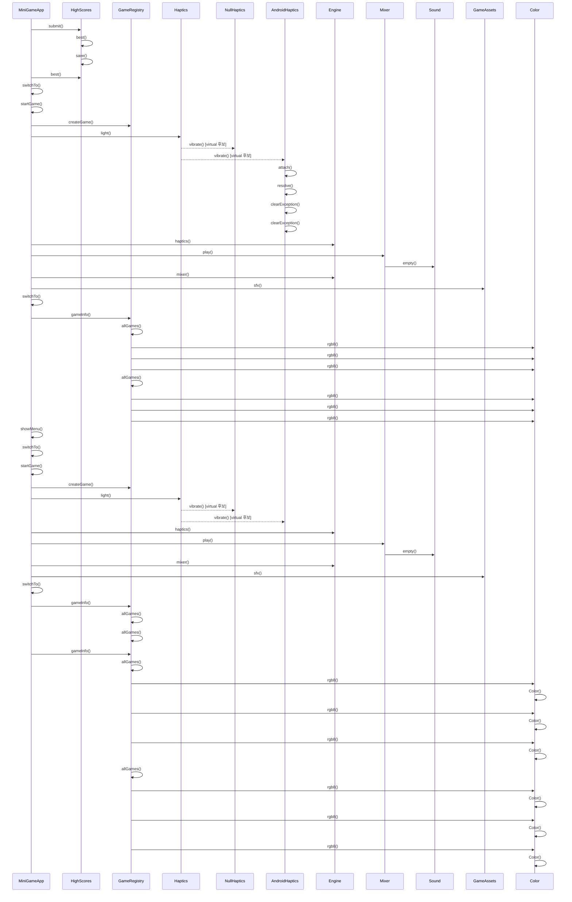

# 게임 종료와 결과 화면 (MiniGameApp::showResult)

**`app::MiniGameApp::showResult(app::GameId, int)` 에서 시작하는 호출 순서를 아래 번호대로 따라가세요.**

## 호출 순서

1. `MiniGameApp` 가 `HighScores::submit()` 를 호출합니다. `app/MiniGameApp.cpp:58`
2. `HighScores` 가 `HighScores::best()` 를 호출합니다. `app/HighScores.cpp:29`
3. `HighScores` 가 `HighScores::save()` 를 호출합니다. `app/HighScores.cpp:33`
4. `MiniGameApp` 가 `HighScores::best()` 를 호출합니다. `app/MiniGameApp.cpp:59`
5. `MiniGameApp` 가 `MiniGameApp::switchTo()` 를 호출합니다. `app/MiniGameApp.cpp:60`
6. `MiniGameApp` 가 `MiniGameApp::startGame()` 를 호출합니다. `app/MiniGameApp.cpp:61`
7. `MiniGameApp` 가 `GameRegistry::createGame()` 를 호출합니다. `app/MiniGameApp.cpp:41`
8. `MiniGameApp` 가 `Haptics::light()` 를 호출합니다. `app/MiniGameApp.cpp:46`
9. `Haptics` 가 `NullHaptics::vibrate()` 를 호출합니다. (virtual 후보) `engine/platform/Haptics.h:14`
10. `Haptics` 가 `AndroidHaptics::vibrate()` 를 호출합니다. (virtual 후보) `engine/platform/Haptics.h:14`
11. `AndroidHaptics` 가 `AndroidHaptics::attach()` 를 호출합니다. `platform/android/AndroidHaptics.cpp:103`
12. `AndroidHaptics` 가 `AndroidHaptics::resolve()` 를 호출합니다. `platform/android/AndroidHaptics.cpp:108`
13. `AndroidHaptics` 가 `AndroidHaptics::clearException()` 를 호출합니다. `platform/android/AndroidHaptics.cpp:133`
14. `MiniGameApp` 가 `Engine::haptics()` 를 호출합니다. `app/MiniGameApp.cpp:46`
15. `MiniGameApp` 가 `Mixer::play()` 를 호출합니다. `app/MiniGameApp.cpp:47`
16. `Mixer` 가 `Sound::empty()` 를 호출합니다. `engine/audio/Mixer.cpp:9`
17. `MiniGameApp` 가 `Engine::mixer()` 를 호출합니다. `app/MiniGameApp.cpp:47`
18. `MiniGameApp` 가 `GameAssets::sfx()` 를 호출합니다. `app/MiniGameApp.cpp:47`
19. `MiniGameApp` 가 `MiniGameApp::switchTo()` 를 호출합니다. `app/MiniGameApp.cpp:51`
20. `MiniGameApp` 가 `GameRegistry::gameInfo()` 를 호출합니다. `app/MiniGameApp.cpp:52`
21. `GameRegistry` 가 `GameRegistry::allGames()` 를 호출합니다. `app/GameRegistry.cpp:19`
22. `GameRegistry` 가 `Color::rgb8()` 를 호출합니다. `app/GameRegistry.cpp:11`
23. `GameRegistry` 가 `GameRegistry::allGames()` 를 호출합니다. `app/GameRegistry.cpp:24`
24. `GameRegistry` 가 `Color::rgb8()` 를 호출합니다. `app/GameRegistry.cpp:11`
25. `MiniGameApp` 가 `MiniGameApp::showMenu()` 를 호출합니다. `app/MiniGameApp.cpp:61`
26. `MiniGameApp` 가 `MiniGameApp::switchTo()` 를 호출합니다. `app/MiniGameApp.cpp:37`
27. `MiniGameApp` 가 `MiniGameApp::startGame()` 를 호출합니다. `app/MiniGameApp.cpp:37`
28. `MiniGameApp` 가 `GameRegistry::createGame()` 를 호출합니다. `app/MiniGameApp.cpp:41`
29. `MiniGameApp` 가 `Haptics::light()` 를 호출합니다. `app/MiniGameApp.cpp:46`
30. `Haptics` 가 `NullHaptics::vibrate()` 를 호출합니다. (virtual 후보) `engine/platform/Haptics.h:14`

(이후 단계는 생략했습니다. 전체 흐름은 위 다이어그램을 보세요.)

## 이 흐름에서 확인할 것

게임 종료 시 `MiniGameApp::showResult` 는 먼저 점수 제출과 결과 조회를 처리한 뒤 게임 시작 로직을 재반복하여 결과 화면으로 전환합니다. `HighScores::submit()` 호출은 `app/MiniGameApp.cpp:58` 에서 발생하며, 이는 곧바로 `HighScores::best()` 를 실행합니다 `app/HighScores.cpp:29`. 이어지는 `HighScores::save()` 는 `app/HighScores.cpp:33` 에서 수행되고, 이 과정에서 `MiniGameApp` 는 다시 `HighScores::best()` 를 호출하여 점수 데이터를 확인합니다 `app/MiniGameApp.cpp:59`. 이후 `MiniGameApp::switchTo()` 가 실행되며 `app/MiniGameApp.cpp:60` 에 기록된 대로 게임 상태가 변경됩니다.

점수 처리 후 `MiniGameApp` 는 `MiniGameApp::startGame()` 을 호출하여 게임 초기화 절차를 시작합니다 `app/MiniGameApp.cpp:61`. 이 단계에서 `GameRegistry::createGame()` 가 실행되며 `app/MiniGameApp.cpp:41` 에서 게임 인스턴스가 생성됩니다. 동시에 `Haptics::light()` 를 통해 햅틱 피드백이 트리거되고 `app/MiniGameApp.cpp:46` 에 명시된 대로 `NullHaptics::vibrate()` 또는 `AndroidHaptics::vibrate()` 가 호출됩니다 `engine/platform/Haptics.h:14`. `AndroidHaptics` 의 경우 `attach()` 와 `resolve()` 를 거쳐 `platform/android/AndroidHaptics.cpp:103` 및 `108` 에서 구체적인 동작을 수행합니다.

음성 효과 재생과 함께 `Mixer::play()` 가 실행되며 `app/MiniGameApp.cpp:47` 에서 `Sound::empty()` 를 호출합니다 `engine/audio/Mixer.cpp:9`. 이 과정에서 `Engine::haptics()` 와 `Engine::mixer()` 는 각각 `app/MiniGameApp.cpp:46` 및 `47` 에서 간접적으로 제어됩니다. 게임 자산 접근을 위해 `GameAssets::sfx()` 가 실행되며 `app/MiniGameApp.cpp:47` 에서 소스 파일을 로드합니다.

결과 화면 전환을 위한 최종 단계로 `MiniGameApp::showMenu()` 가 호출되어 `app/MiniGameApp.cpp:61` 에서 메뉴 인터페이스가 표시됩니다. 이 과정에서 `MiniGameApp::switchTo()` 와 `MiniGameApp::startGame()` 가 다시 호출되며 `app/MiniGameApp.cpp:37` 및 `41` 을 경유합니다. `GameRegistry::gameInfo()` 는 `app/MiniGameApp.cpp:52` 에서 실행되어 게임 정보를 조회하고, 이는 `GameRegistry::allGames()` 를 통해 `app/GameRegistry.cpp:19` 에서 처리됩니다.

색상 데이터는 `GameRegistry::allGames()` 가 `app/GameRegistry.cpp:24` 에서 호출하며, 이는 `Color::rgb8()` 를 통해 `app/GameRegistry.cpp:11` 에서 변환됩니다. 전체 흐름은 점수 제출부터 시작하여 햅틱 및 오디오 피드백을 거쳐 최종 메뉴 화면으로 이어지며, 각 단계는 명시된 파일과 줄에서 실행됩니다.

??? note "근거와 검토 정보"
    - 근거 파일: `app/GameRegistry.cpp`, `app/HighScores.cpp`, `app/MiniGameApp.cpp`, `engine/audio/Mixer.cpp`, `engine/platform/Haptics.h`, `platform/android/AndroidHaptics.cpp`
    - 근거 수준: 코드 확인 (정적 분석, simple_compdb 구성, commit `b4e0160483`)
    - 인용 검증: 통과
    - 검토: 2026-09-17 · ollama/qwen3.5:4b · 사람 검토 전

다음 단계: [게임 시작 (MiniGameApp::startGame)](start_game.md)
