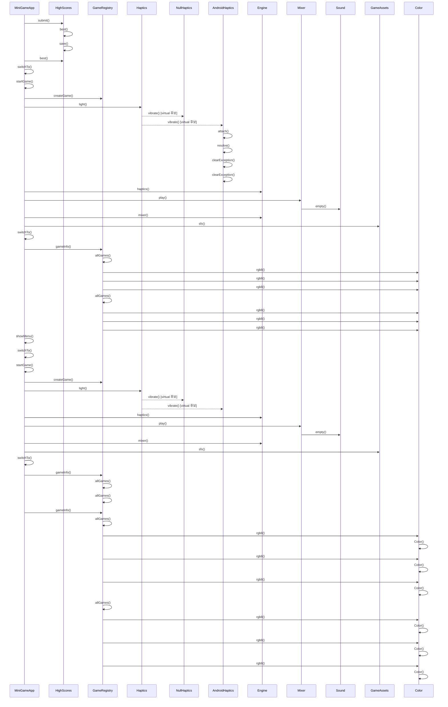

# 게임 종료와 결과 화면 (MiniGameApp::showResult)

**아래 코드 대조 설명을 먼저 읽으세요. 다이어그램과 번호 목록은 정적 호출 후보이며, 실행 순서·분기·콜백 시점을 정확히 재현하지 않습니다.**

## 이 흐름에서 확인할 것

`MiniGameApp::showResult`는 활성 게임 포인터를 지우고 점수를 제출한 뒤 최고 점수와 신기록 여부로 결과 데이터를 만듭니다 (`app/MiniGameApp.cpp:55`). `ResultScene`에 재시작 콜백과 홈 콜백을 전달하고, `switchTo`로 다음 장면을 예약합니다.

람다 안의 `startGame`과 `showMenu`는 이 함수에서 즉시 실행하지 않습니다. 결과 화면에서 해당 입력을 받을 때 실행할 콜백입니다 (`app/MiniGameApp.cpp:60`). 따라서 아래 정적 목록에 펼쳐진 게임 생성·진동·클릭 효과음 호출을 결과 화면 진입 시 실행되는 순서로 읽으면 안 됩니다. 실제 장면 교체는 다음 업데이트 시작 시점에 수행합니다.

정적 분석 한계: 가상 호출 대상, 콜백 실행 시점, 조건 분기는 코드와 함께 확인해야 합니다. 이번 검토는 기기 실행 검증을 포함하지 않습니다.

## 정적 호출 후보 (실행 추적 아님)

1. `MiniGameApp` 가 `HighScores::submit()` 를 호출합니다. `app/MiniGameApp.cpp:58`
2. `HighScores` 가 `HighScores::best()` 를 호출합니다. `app/HighScores.cpp:29`
3. `HighScores` 가 `HighScores::save()` 를 호출합니다. `app/HighScores.cpp:33`
4. `MiniGameApp` 가 `HighScores::best()` 를 호출합니다. `app/MiniGameApp.cpp:59`
5. `MiniGameApp` 가 `MiniGameApp::switchTo()` 를 호출합니다. `app/MiniGameApp.cpp:60`
6. `MiniGameApp` 가 `MiniGameApp::startGame()` 를 호출합니다. `app/MiniGameApp.cpp:61`
7. `MiniGameApp` 가 `GameRegistry::createGame()` 를 호출합니다. `app/MiniGameApp.cpp:41`
8. `MiniGameApp` 가 `Haptics::light()` 를 호출합니다. `app/MiniGameApp.cpp:46`
9. `Haptics` 가 `NullHaptics::vibrate()` 를 호출합니다. (virtual 후보) `engine/platform/Haptics.h:14`
10. `Haptics` 가 `AndroidHaptics::vibrate()` 를 호출합니다. (virtual 후보) `engine/platform/Haptics.h:14`
11. `AndroidHaptics` 가 `AndroidHaptics::attach()` 를 호출합니다. `platform/android/AndroidHaptics.cpp:103`
12. `AndroidHaptics` 가 `AndroidHaptics::resolve()` 를 호출합니다. `platform/android/AndroidHaptics.cpp:108`
13. `AndroidHaptics` 가 `AndroidHaptics::clearException()` 를 호출합니다. `platform/android/AndroidHaptics.cpp:133`
14. `MiniGameApp` 가 `Engine::haptics()` 를 호출합니다. `app/MiniGameApp.cpp:46`
15. `MiniGameApp` 가 `Mixer::play()` 를 호출합니다. `app/MiniGameApp.cpp:47`
16. `Mixer` 가 `Sound::empty()` 를 호출합니다. `engine/audio/Mixer.cpp:9`
17. `MiniGameApp` 가 `Engine::mixer()` 를 호출합니다. `app/MiniGameApp.cpp:47`
18. `MiniGameApp` 가 `GameAssets::sfx()` 를 호출합니다. `app/MiniGameApp.cpp:47`
19. `MiniGameApp` 가 `MiniGameApp::switchTo()` 를 호출합니다. `app/MiniGameApp.cpp:51`
20. `MiniGameApp` 가 `GameRegistry::gameInfo()` 를 호출합니다. `app/MiniGameApp.cpp:52`
21. `GameRegistry` 가 `GameRegistry::allGames()` 를 호출합니다. `app/GameRegistry.cpp:19`
22. `GameRegistry` 가 `Color::rgb8()` 를 호출합니다. `app/GameRegistry.cpp:11`
23. `GameRegistry` 가 `GameRegistry::allGames()` 를 호출합니다. `app/GameRegistry.cpp:24`
24. `GameRegistry` 가 `Color::rgb8()` 를 호출합니다. `app/GameRegistry.cpp:11`
25. `MiniGameApp` 가 `MiniGameApp::showMenu()` 를 호출합니다. `app/MiniGameApp.cpp:61`
26. `MiniGameApp` 가 `MiniGameApp::switchTo()` 를 호출합니다. `app/MiniGameApp.cpp:37`
27. `MiniGameApp` 가 `MiniGameApp::startGame()` 를 호출합니다. `app/MiniGameApp.cpp:37`
28. `MiniGameApp` 가 `GameRegistry::createGame()` 를 호출합니다. `app/MiniGameApp.cpp:41`
29. `MiniGameApp` 가 `Haptics::light()` 를 호출합니다. `app/MiniGameApp.cpp:46`
30. `Haptics` 가 `NullHaptics::vibrate()` 를 호출합니다. (virtual 후보) `engine/platform/Haptics.h:14`

(이후 단계는 생략했습니다. 전체 흐름은 위 다이어그램을 보세요.)

??? note "근거와 검토 정보"
    - 근거 파일: `app/GameRegistry.cpp`, `app/HighScores.cpp`, `app/MiniGameApp.cpp`, `engine/audio/Mixer.cpp`, `engine/platform/Haptics.h`, `platform/android/AndroidHaptics.cpp`
    - 근거 수준: 코드 확인 (정적 분석, simple_compdb 구성, commit `aeac213063`)
    - 인용 검증: 통과
    - 검토: 2026-09-17 · ollama/qwen3.5:4b · 생성 당시 기록 (후속 코드 대조: docs/sdd-review.json)

다음 단계: [게임 시작 (MiniGameApp::startGame)](start_game.md)
