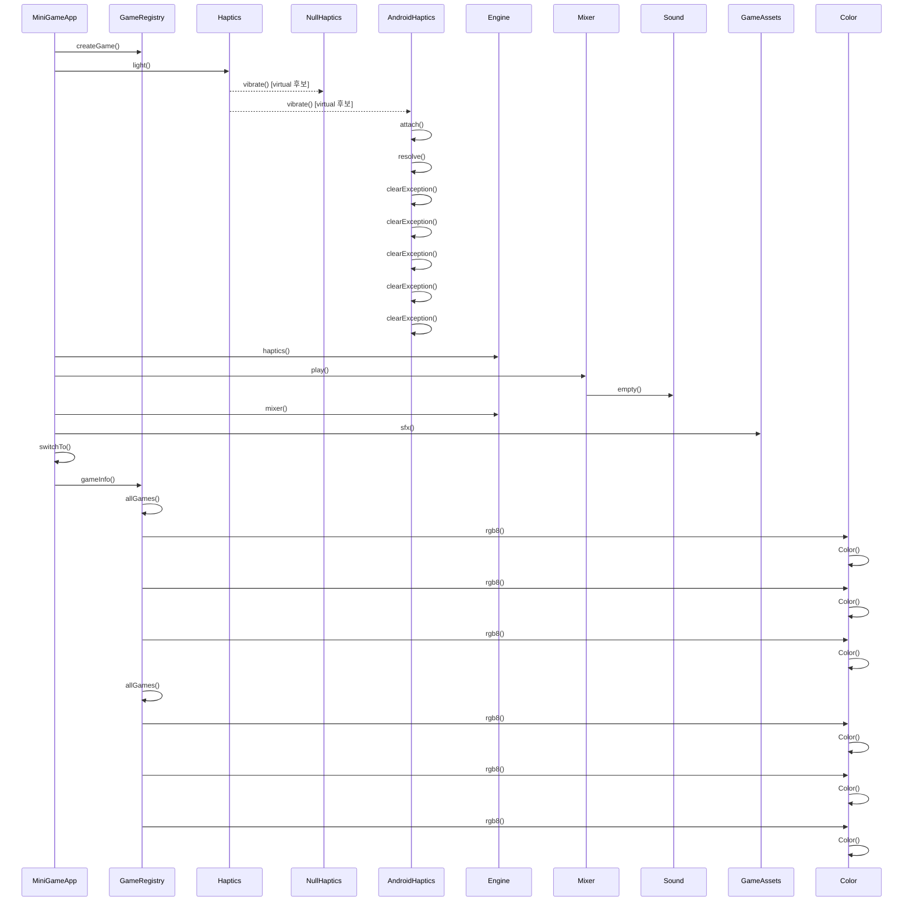

# 게임 시작 (MiniGameApp::startGame)

**아래 코드 대조 설명을 먼저 읽으세요. 다이어그램과 번호 목록은 정적 호출 후보이며, 실행 순서·분기·콜백 시점을 정확히 재현하지 않습니다.**

## 이 흐름에서 확인할 것

`MiniGameApp::startGame`은 `createGame`으로 ID에 해당하는 게임 객체를 만듭니다. 객체 생성이 실패하면 로그를 남기고 반환합니다 (`app/MiniGameApp.cpp:40`, `app/GameRegistry.cpp:27`). 성공하면 가벼운 진동을 요청하고 클릭 효과음을 믹서에 등록한 뒤 활성 게임 상태를 설정합니다. 이 호출들은 게임 스레드에서 순서대로 실행하며, 실제 음원 혼합은 오디오 콜백이 수행합니다.

`switchTo`는 새 장면을 `pending_`에 보관합니다. 실제 장면 교체와 `onEnter` 호출은 다음 `MiniGameApp::update` 시작 시점에 일어납니다 (`app/MiniGameApp.cpp:30`, `app/MiniGameApp.cpp:65`). `gameInfo`는 로그에 사용할 정보를 조회하며, 게임을 등록하거나 재귀적으로 실행하는 함수가 아닙니다.

정적 분석 한계: 가상 호출 대상, 콜백 실행 시점, 조건 분기는 코드와 함께 확인해야 합니다. 이번 검토는 기기 실행 검증을 포함하지 않습니다.

## 정적 호출 후보 (실행 추적 아님)

1. `MiniGameApp` 가 `GameRegistry::createGame()` 를 호출합니다. `app/MiniGameApp.cpp:41`
2. `MiniGameApp` 가 `Haptics::light()` 를 호출합니다. `app/MiniGameApp.cpp:46`
3. `Haptics` 가 `NullHaptics::vibrate()` 를 호출합니다. (virtual 후보) `engine/platform/Haptics.h:14`
4. `Haptics` 가 `AndroidHaptics::vibrate()` 를 호출합니다. (virtual 후보) `engine/platform/Haptics.h:14`
5. `AndroidHaptics` 가 `AndroidHaptics::attach()` 를 호출합니다. `platform/android/AndroidHaptics.cpp:103`
6. `AndroidHaptics` 가 `AndroidHaptics::resolve()` 를 호출합니다. `platform/android/AndroidHaptics.cpp:108`
7. `AndroidHaptics` 가 `AndroidHaptics::clearException()` 를 호출합니다. `platform/android/AndroidHaptics.cpp:70`
8. `MiniGameApp` 가 `Engine::haptics()` 를 호출합니다. `app/MiniGameApp.cpp:46`
9. `MiniGameApp` 가 `Mixer::play()` 를 호출합니다. `app/MiniGameApp.cpp:47`
10. `Mixer` 가 `Sound::empty()` 를 호출합니다. `engine/audio/Mixer.cpp:9`
11. `MiniGameApp` 가 `Engine::mixer()` 를 호출합니다. `app/MiniGameApp.cpp:47`
12. `MiniGameApp` 가 `GameAssets::sfx()` 를 호출합니다. `app/MiniGameApp.cpp:47`
13. `MiniGameApp` 가 `MiniGameApp::switchTo()` 를 호출합니다. `app/MiniGameApp.cpp:51`
14. `MiniGameApp` 가 `GameRegistry::gameInfo()` 를 호출합니다. `app/MiniGameApp.cpp:52`
15. `GameRegistry` 가 `GameRegistry::allGames()` 를 호출합니다. `app/GameRegistry.cpp:19`
16. `GameRegistry` 가 `Color::rgb8()` 를 호출합니다. `app/GameRegistry.cpp:11`
17. `Color` 가 `Color::Color()` 를 호출합니다. `engine/math/Color.h:18`
18. `GameRegistry` 가 `Color::rgb8()` 를 호출합니다. `app/GameRegistry.cpp:12`
19. `Color` 가 `Color::Color()` 를 호출합니다. `engine/math/Color.h:18`
20. `GameRegistry` 가 `Color::rgb8()` 를 호출합니다. `app/GameRegistry.cpp:13`
21. `Color` 가 `Color::Color()` 를 호출합니다. `engine/math/Color.h:18`
22. `GameRegistry` 가 `GameRegistry::allGames()` 를 호출합니다. `app/GameRegistry.cpp:24`
23. `GameRegistry` 가 `Color::rgb8()` 를 호출합니다. `app/GameRegistry.cpp:11`
24. `Color` 가 `Color::Color()` 를 호출합니다. `engine/math/Color.h:18`
25. `GameRegistry` 가 `Color::rgb8()` 를 호출합니다. `app/GameRegistry.cpp:12`
26. `Color` 가 `Color::Color()` 를 호출합니다. `engine/math/Color.h:18`
27. `GameRegistry` 가 `Color::rgb8()` 를 호출합니다. `app/GameRegistry.cpp:13`
28. `Color` 가 `Color::Color()` 를 호출합니다. `engine/math/Color.h:18`

??? note "근거와 검토 정보"
    - 근거 파일: `app/GameRegistry.cpp`, `app/MiniGameApp.cpp`, `engine/audio/Mixer.cpp`, `engine/math/Color.h`, `engine/platform/Haptics.h`, `platform/android/AndroidHaptics.cpp`
    - 근거 수준: 코드 확인 (정적 분석, simple_compdb 구성, commit `aeac213063`)
    - 인용 검증: 통과
    - 검토: 2026-09-17 · ollama/qwen3.5:4b · 생성 당시 기록 (후속 코드 대조: docs/sdd-review.json)

다음 단계: [터치 입력 전달 (Engine::onTouch)](touch.md)
