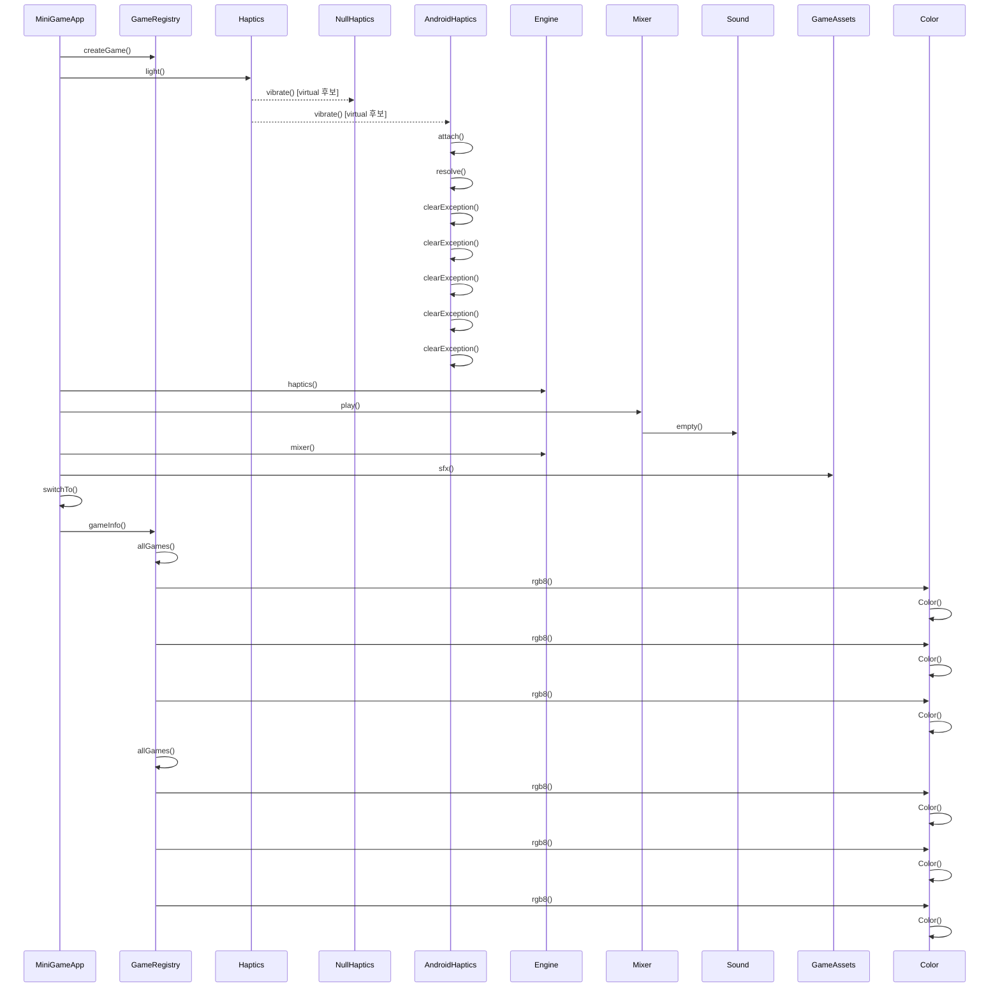

# 게임 시작 (MiniGameApp::startGame)

**`app::MiniGameApp::startGame(app::GameId)` 에서 시작하는 호출 순서를 아래 번호대로 따라가세요.**

## 호출 순서

1. `MiniGameApp` 가 `GameRegistry::createGame()` 를 호출합니다. `app/MiniGameApp.cpp:41`
2. `MiniGameApp` 가 `Haptics::light()` 를 호출합니다. `app/MiniGameApp.cpp:46`
3. `Haptics` 가 `NullHaptics::vibrate()` 를 호출합니다. (virtual 후보) `engine/platform/Haptics.h:14`
4. `Haptics` 가 `AndroidHaptics::vibrate()` 를 호출합니다. (virtual 후보) `engine/platform/Haptics.h:14`
5. `AndroidHaptics` 가 `AndroidHaptics::attach()` 를 호출합니다. `platform/android/AndroidHaptics.cpp:103`
6. `AndroidHaptics` 가 `AndroidHaptics::resolve()` 를 호출합니다. `platform/android/AndroidHaptics.cpp:108`
7. `AndroidHaptics` 가 `AndroidHaptics::clearException()` 를 호출합니다. `platform/android/AndroidHaptics.cpp:70`
8. `MiniGameApp` 가 `Engine::haptics()` 를 호출합니다. `app/MiniGameApp.cpp:46`
9. `MiniGameApp` 가 `Mixer::play()` 를 호출합니다. `app/MiniGameApp.cpp:47`
10. `Mixer` 가 `Sound::empty()` 를 호출합니다. `engine/audio/Mixer.cpp:9`
11. `MiniGameApp` 가 `Engine::mixer()` 를 호출합니다. `app/MiniGameApp.cpp:47`
12. `MiniGameApp` 가 `GameAssets::sfx()` 를 호출합니다. `app/MiniGameApp.cpp:47`
13. `MiniGameApp` 가 `MiniGameApp::switchTo()` 를 호출합니다. `app/MiniGameApp.cpp:51`
14. `MiniGameApp` 가 `GameRegistry::gameInfo()` 를 호출합니다. `app/MiniGameApp.cpp:52`
15. `GameRegistry` 가 `GameRegistry::allGames()` 를 호출합니다. `app/GameRegistry.cpp:19`
16. `GameRegistry` 가 `Color::rgb8()` 를 호출합니다. `app/GameRegistry.cpp:11`
17. `Color` 가 `Color::Color()` 를 호출합니다. `engine/math/Color.h:18`
18. `GameRegistry` 가 `Color::rgb8()` 를 호출합니다. `app/GameRegistry.cpp:12`
19. `Color` 가 `Color::Color()` 를 호출합니다. `engine/math/Color.h:18`
20. `GameRegistry` 가 `Color::rgb8()` 를 호출합니다. `app/GameRegistry.cpp:13`
21. `Color` 가 `Color::Color()` 를 호출합니다. `engine/math/Color.h:18`
22. `GameRegistry` 가 `GameRegistry::allGames()` 를 호출합니다. `app/GameRegistry.cpp:24`
23. `GameRegistry` 가 `Color::rgb8()` 를 호출합니다. `app/GameRegistry.cpp:11`
24. `Color` 가 `Color::Color()` 를 호출합니다. `engine/math/Color.h:18`
25. `GameRegistry` 가 `Color::rgb8()` 를 호출합니다. `app/GameRegistry.cpp:12`
26. `Color` 가 `Color::Color()` 를 호출합니다. `engine/math/Color.h:18`
27. `GameRegistry` 가 `Color::rgb8()` 를 호출합니다. `app/GameRegistry.cpp:13`
28. `Color` 가 `Color::Color()` 를 호출합니다. `engine/math/Color.h:18`

## 이 흐름에서 확인할 것

`MiniGameApp::startGame()` 는 게임 시작 시 `GameRegistry::createGame()` 를 먼저 호출하여 게임 등록을 처리합니다 `app/MiniGameApp.cpp:41`. 이 호출은 `Haptics::light()` 와 `Engine::haptics()` 를 병렬로 실행하며, 후자는 `Mixer::play()` 와 `GameAssets::sfx()` 를 거쳐 오디오 및 자산 로딩이 시작됩니다 `app/MiniGameApp.cpp:46`~`47`. 게임 정보 조회를 위해 `GameRegistry::gameInfo()` 가 호출되며, 이는 `Color::rgb8()` 를 통해 각 게임의 색상 정보를 순차적으로 생성합니다 `app/MiniGameApp.cpp:52`. `Color::rgb8()` 는 내부적으로 `Color::Color()` 인스턴스를 생성하여 색상을 반환하며, 이 과정은 `GameRegistry::allGames()` 의 반복 호출과 함께 여러 번 재현됩니다 `engine/math/Color.h:18`~`app/GameRegistry.cpp:13`. 분기점은 `Haptics` 가상 함수가 플랫폼 구현 (`NullHaptics`, `AndroidHaptics`) 으로 넘어가는 것이며, 정적 추적이 끊기는 지점은 `GameRegistry` 의 재귀 호출과 `Color::rgb8()` 의 반복 로직에 있습니다.

??? note "근거와 검토 정보"
    - 근거 파일: `app/GameRegistry.cpp`, `app/MiniGameApp.cpp`, `engine/audio/Mixer.cpp`, `engine/math/Color.h`, `engine/platform/Haptics.h`, `platform/android/AndroidHaptics.cpp`
    - 근거 수준: 코드 확인 (정적 분석, simple_compdb 구성, commit `aeac213063`)
    - 인용 검증: 통과
    - 검토: 2026-09-17 · ollama/qwen3.5:4b · 사람 검토 전

다음 단계: [터치 입력 전달 (Engine::onTouch)](touch.md)
