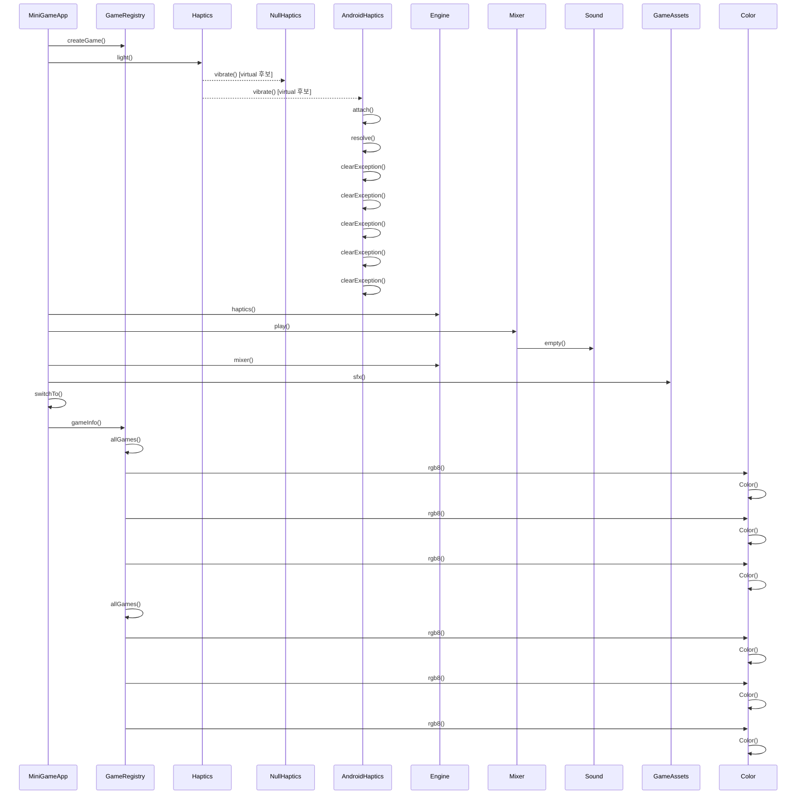

# 게임 시작 (MiniGameApp::startGame)

**`app::MiniGameApp::startGame(app::GameId)` 에서 시작하는 호출 순서를 아래 번호대로 따라가세요.**

## 호출 순서

1. `MiniGameApp` 가 `GameRegistry::createGame()` 를 호출합니다. `app/MiniGameApp.cpp:41`
2. `MiniGameApp` 가 `Haptics::light()` 를 호출합니다. `app/MiniGameApp.cpp:46`
3. `Haptics` 가 `NullHaptics::vibrate()` 를 호출합니다. (virtual 후보) `engine/platform/Haptics.h:14`
4. `Haptics` 가 `AndroidHaptics::vibrate()` 를 호출합니다. (virtual 후보) `engine/platform/Haptics.h:14`
5. `AndroidHaptics` 가 `AndroidHaptics::attach()` 를 호출합니다. `platform/android/AndroidHaptics.cpp:103`
6. `AndroidHaptics` 가 `AndroidHaptics::resolve()` 를 호출합니다. `platform/android/AndroidHaptics.cpp:108`
7. `AndroidHaptics` 가 `AndroidHaptics::clearException()` 를 호출합니다. `platform/android/AndroidHaptics.cpp:70`
8. `MiniGameApp` 가 `Engine::haptics()` 를 호출합니다. `app/MiniGameApp.cpp:46`
9. `MiniGameApp` 가 `Mixer::play()` 를 호출합니다. `app/MiniGameApp.cpp:47`
10. `Mixer` 가 `Sound::empty()` 를 호출합니다. `engine/audio/Mixer.cpp:9`
11. `MiniGameApp` 가 `Engine::mixer()` 를 호출합니다. `app/MiniGameApp.cpp:47`
12. `MiniGameApp` 가 `GameAssets::sfx()` 를 호출합니다. `app/MiniGameApp.cpp:47`
13. `MiniGameApp` 가 `MiniGameApp::switchTo()` 를 호출합니다. `app/MiniGameApp.cpp:51`
14. `MiniGameApp` 가 `GameRegistry::gameInfo()` 를 호출합니다. `app/MiniGameApp.cpp:52`
15. `GameRegistry` 가 `GameRegistry::allGames()` 를 호출합니다. `app/GameRegistry.cpp:19`
16. `GameRegistry` 가 `Color::rgb8()` 를 호출합니다. `app/GameRegistry.cpp:11`
17. `Color` 가 `Color::Color()` 를 호출합니다. `engine/math/Color.h:18`
18. `GameRegistry` 가 `Color::rgb8()` 를 호출합니다. `app/GameRegistry.cpp:12`
19. `Color` 가 `Color::Color()` 를 호출합니다. `engine/math/Color.h:18`
20. `GameRegistry` 가 `Color::rgb8()` 를 호출합니다. `app/GameRegistry.cpp:13`
21. `Color` 가 `Color::Color()` 를 호출합니다. `engine/math/Color.h:18`
22. `GameRegistry` 가 `GameRegistry::allGames()` 를 호출합니다. `app/GameRegistry.cpp:24`
23. `GameRegistry` 가 `Color::rgb8()` 를 호출합니다. `app/GameRegistry.cpp:11`
24. `Color` 가 `Color::Color()` 를 호출합니다. `engine/math/Color.h:18`
25. `GameRegistry` 가 `Color::rgb8()` 를 호출합니다. `app/GameRegistry.cpp:12`
26. `Color` 가 `Color::Color()` 를 호출합니다. `engine/math/Color.h:18`
27. `GameRegistry` 가 `Color::rgb8()` 를 호출합니다. `app/GameRegistry.cpp:13`
28. `Color` 가 `Color::Color()` 를 호출합니다. `engine/math/Color.h:18`

## 이 흐름에서 확인할 것

`MiniGameApp::startGame()` 는 게임 ID 를 인자로 받으면 먼저 `GameRegistry::createGame()` 를 호출하여 게임 등록을 시작합니다 `app/MiniGameApp.cpp:41`. 이 직후 `Haptics::light()` 를 호출해 진동기를 초기화하고, 그 후 `Engine::haptics()` 와 `Mixer::play()` 를 순차적으로 실행합니다 `app/MiniGameApp.cpp:46~47`. 동시에 `Engine::mixer()` 와 `GameAssets::sfx()` 를 호출하여 오디오 시스템과 사운드 효과를 준비합니다 `app/MiniGameApp.cpp:47`. 이후 `switchTo()` 를 통해 현재 게임 화면을 전환하고, `GameRegistry::gameInfo()` 를 호출해 게임 정보를 조회합니다 `app/MiniGameApp.cpp:51~52`. 이 과정에서 `GameRegistry` 는 `allGames()` 와 `Color::rgb8()` 를 반복적으로 호출하며 각 색상을 생성하는 `Color::Color()` 을 여러 번 실행합니다 `app/GameRegistry.cpp:19, 11~13`.

분기는 `Haptics` 의 가상 함수 호출 시점에 발생하며, `AndroidHaptics::attach()` 와 `resolve()` 를 거쳐 실제 하드웨어 연결을 시도합니다 `platform/android/AndroidHaptics.cpp:103~108`. 정적 추적이 끊기는 지점은 `GameRegistry` 가 `allGames()` 를 호출하여 게임 목록을 순회하며 색상을 생성하는 반복적인 패턴이 나타나는 부분입니다 `app/GameRegistry.cpp:19, 24`. `Color::rgb8()` 의 재귀적 호출 구조는 `engine/math/Color.h:18` 에서 구현되어 있으며, 이는 각 게임의 색상 정보를 독립적으로 처리하기 위한 설계로 보입니다 `engine/math/Color.h:18`.

다음 단계로 `GameRegistry` 가 모든 게임을 초기화하고 색상을 생성하는 과정이 완료되면, `MiniGameApp::switchTo()` 를 통해 실제 게임 로직이 실행됩니다. 이 과정에서 `AndroidHaptics::clearException()` 을 호출하여 이전 오류를 초기화합니다 `platform/android/AndroidHaptics.cpp:70`.

??? note "근거와 검토 정보"
    - 근거 파일: `app/GameRegistry.cpp`, `app/MiniGameApp.cpp`, `engine/audio/Mixer.cpp`, `engine/math/Color.h`, `engine/platform/Haptics.h`, `platform/android/AndroidHaptics.cpp`
    - 근거 수준: 코드 확인 (정적 분석, simple_compdb 구성, commit `b4e0160483`)
    - 인용 검증: 통과
    - 검토: 2026-09-17 · ollama/qwen3.5:4b · 사람 검토 전

다음 단계: [터치 입력 전달 (Engine::onTouch)](touch.md)
