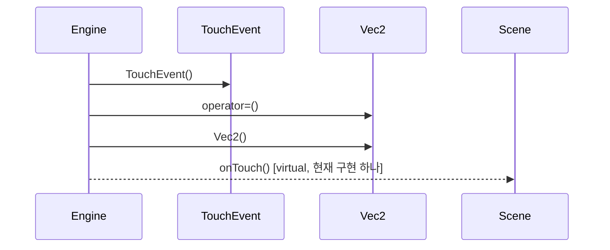

# 터치 입력 전달 (Engine::onTouch)

**`engine::Engine::onTouch(int32_t, engine::TouchEvent::Phase, float, float)` 에서 시작하는 호출 순서를 아래 번호대로 따라가세요.**

## 호출 순서

1. `Engine` 가 `TouchEvent::TouchEvent()` 를 호출합니다. `engine/Engine.cpp:120`
2. `Engine` 가 `Vec2::operator=()` 를 호출합니다. `engine/Engine.cpp:123`
3. `Engine` 가 `Vec2::Vec2()` 를 호출합니다. `engine/Engine.cpp:123`
4. `Engine` 가 `Scene::onTouch()` 를 호출합니다. (virtual, 현재 구현 하나) `engine/Engine.cpp:124`

## 이 흐름에서 확인할 것

Touch 입력 전달은 `Engine::onTouch` 진입점에서 시작하여 `Scene::onTouch` 가상 함수로 이어지는 순환 경로를 따릅니다. `Engine` 는 먼저 `TouchEvent` 객체를 생성한 뒤 `Vec2` 좌표를 초기화합니다. 이후 `Engine` 가 직접 호출하는 유일한 동작은 `Scene::onTouch()` 입니다.

`Engine::onTouch(int32_t, engine::TouchEvent::Phase, float, float)` 함수는 입력 처리의 진입점으로 정의됩니다 `engine/Engine.cpp:120`. 이 함수 내부에서 `TouchEvent` 객체가 생성되고 `Vec2::operator=()` 가 호출되어 좌표가 설정됩니다 `engine/Engine.cpp:123`. 최종적으로 `Scene::onTouch()` 가상 함수가 호출되며, 이는 현재 하나의 구현만 존재합니다 `engine/Engine.cpp:124`.

이 과정에서 분기가 발생하거나 정적 추적이 끊기는 지점은 명시된 사실 목록에 없습니다. `Scene` 의 다른 가상 함수나 `GameRegistry` 를 통한 추가 경로는 확인 필요: 어떤 가상 함수가 호출되고 있는지, `GameRegistry` 가 이 흐름에 관여하는지 확인해야 합니다.

??? note "근거와 검토 정보"
    - 근거 파일: `engine/Engine.cpp`
    - 근거 수준: 코드 확인 (정적 분석, simple_compdb 구성, commit `b4e0160483`)
    - 인용 검증: 통과
    - 검토: 2026-09-17 · ollama/qwen3.5:4b · 사람 검토 전

다음 단계: [핵심 시나리오 목록](index.md)
