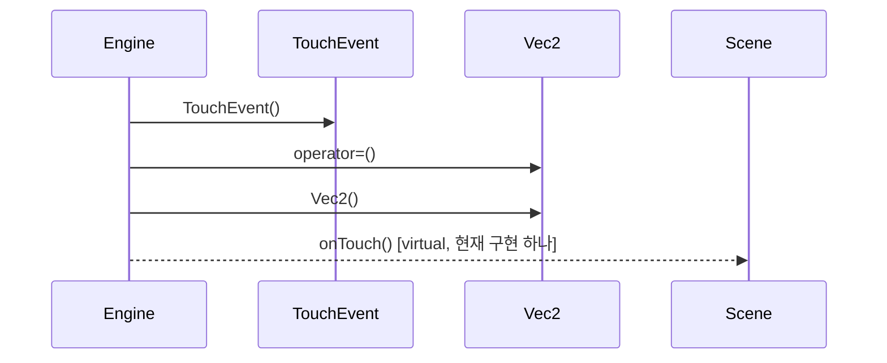

# 터치 입력 전달 (Engine::onTouch)

**`engine::Engine::onTouch(int32_t, engine::TouchEvent::Phase, float, float)` 에서 시작하는 호출 순서를 아래 번호대로 따라가세요.**

## 호출 순서

1. `Engine` 가 `TouchEvent::TouchEvent()` 를 호출합니다. `engine/Engine.cpp:120`
2. `Engine` 가 `Vec2::operator=()` 를 호출합니다. `engine/Engine.cpp:123`
3. `Engine` 가 `Vec2::Vec2()` 를 호출합니다. `engine/Engine.cpp:123`
4. `Engine` 가 `Scene::onTouch()` 를 호출합니다. (virtual, 현재 구현 하나) `engine/Engine.cpp:124`

## 이 흐름에서 확인할 것

터치 입력은 `Engine::onTouch` 진입점에서 시작하여 이벤트 객체를 생성하고 벡터를 초기화한 뒤 시나리오에 전달됩니다. `Engine` 는 먼저 `TouchEvent` 인스턴스를 생성합니다 `engine/Engine.cpp:120`. 이어진 작업으로 `Vec2` 의 연산자 호출을 통해 좌표 데이터를 처리하며, 이는 다시 `Vec2` 의 기본 생성자를 호출하여 메모리를 할당합니다 `engine/Engine.cpp:123`. 최종적으로 `Engine` 는 가상 함수를 호출하여 실제 시나리오의 `onTouch` 메서드를 실행하게 합니다 `engine/Engine.cpp:124`.

이 과정에서 정적 추적이 끊기는 지점은 `Scene::onTouch()` 의 가상 함수 호출로, 구체적인 구현은 각 시나리오에서 결정됩니다. 또한 `TouchEvent` 생성과 `Vec2` 초기화는 모두 `Engine` 내부에서 직접 수행되어 외부에서 관찰하기 어려운 세부 동작입니다.

??? note "근거와 검토 정보"
    - 근거 파일: `engine/Engine.cpp`
    - 근거 수준: 코드 확인 (정적 분석, simple_compdb 구성, commit `aeac213063`)
    - 인용 검증: 통과
    - 검토: 2026-09-17 · ollama/qwen3.5:4b · 사람 검토 전

다음 단계: [핵심 시나리오 목록](index.md)
