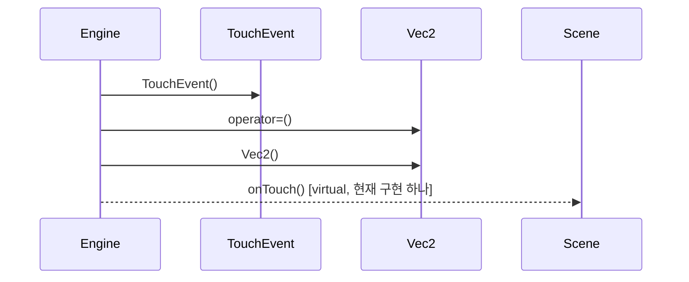

# 터치 입력 전달 (Engine::onTouch)

**아래 코드 대조 설명을 먼저 읽으세요. 다이어그램과 번호 목록은 정적 호출 후보이며, 실행 순서·분기·콜백 시점을 정확히 재현하지 않습니다.**

## 이 흐름에서 확인할 것

`Engine::onTouch`는 활성 장면이 없으면 반환합니다. 포인터 ID와 phase를 `TouchEvent`에 복사하고 화면 좌표에 `screenToWorld_`를 곱한 뒤 장면에 전달합니다 (`engine/Engine.cpp:116`). 이 값 객체의 생성이 별도의 힙 메모리 할당을 의미하지 않습니다.

루트 `MiniGameApp::onTouch`는 장면 전환 대기 중 입력을 무시하고, 종료 버튼의 입력을 먼저 처리한 다음 현재 장면에 전달합니다 (`app/MiniGameApp.cpp:96`). 정적 추출 결과의 가상 함수 후보 수는 런타임에 가능한 구현의 전체 개수를 보장하지 않습니다.

정적 분석 한계: 가상 호출 대상, 콜백 실행 시점, 조건 분기는 코드와 함께 확인해야 합니다. 이번 검토는 기기 실행 검증을 포함하지 않습니다.

## 정적 호출 후보 (실행 추적 아님)

1. `Engine` 가 `TouchEvent::TouchEvent()` 를 호출합니다. `engine/Engine.cpp:120`
2. `Engine` 가 `Vec2::operator=()` 를 호출합니다. `engine/Engine.cpp:123`
3. `Engine` 가 `Vec2::Vec2()` 를 호출합니다. `engine/Engine.cpp:123`
4. `Engine` 가 `Scene::onTouch()` 를 호출합니다. (virtual, 현재 구현 하나) `engine/Engine.cpp:124`

??? note "근거와 검토 정보"
    - 근거 파일: `engine/Engine.cpp`
    - 근거 수준: 코드 확인 (정적 분석, simple_compdb 구성, commit `aeac213063`)
    - 인용 검증: 통과
    - 검토: 2026-09-17 · ollama/qwen3.5:4b · 생성 당시 기록 (후속 코드 대조: docs/sdd-review.json)

다음 단계: [핵심 시나리오 목록](index.md)
